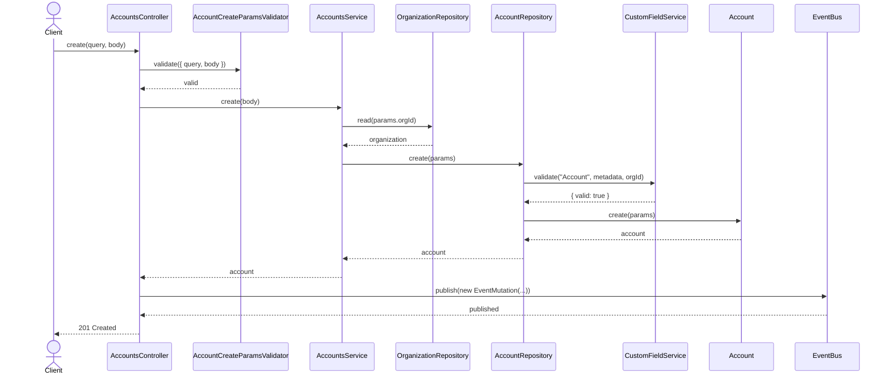
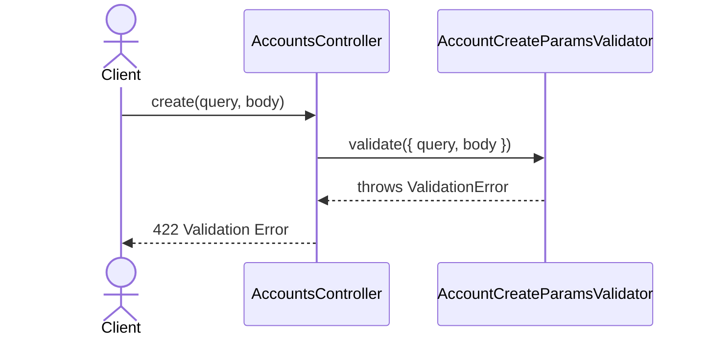
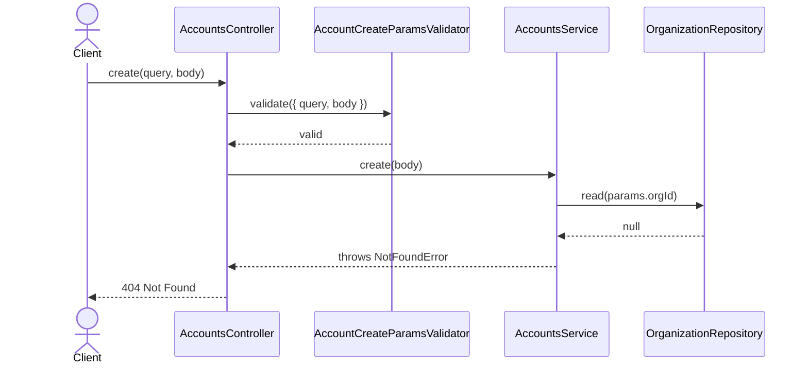
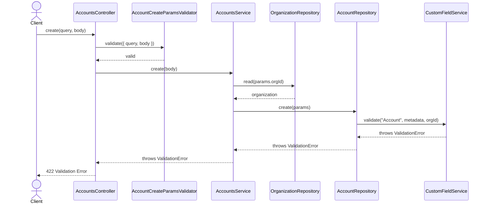

# AccountsController.create

Brief overview: Validates the create request, delegates to `AccountsService` for organization lookup and account creation, performs custom field validation inside `AccountRepository.create`, publishes an event, and returns the created account with public fields only.

## Method

- Route: `POST /v1/accounts`
- Signature: `AccountsController.create(query: {}, body: AccountCreateBodyInterface)`

## Success

## 422 Validation Error

## 404 Not Found

## 422 Custom Field Validation Error

