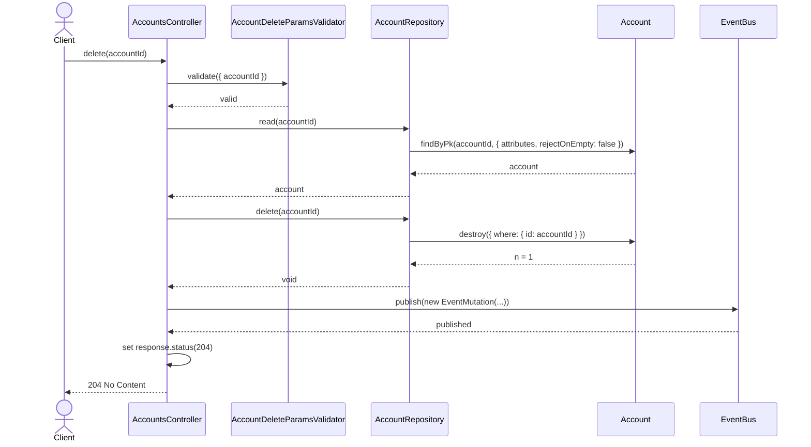
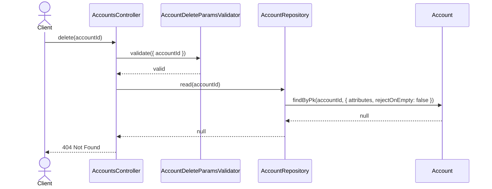
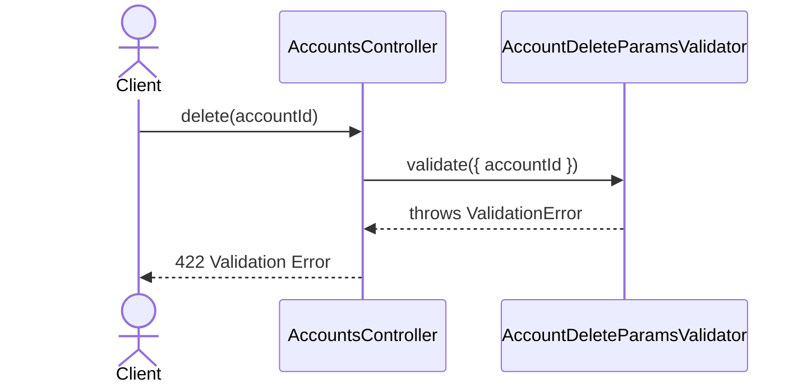

# AccountsController.delete

Brief overview: Validates the account id, reads the target account before deletion, deletes it through `AccountRepository`, publishes a delete event, and finishes with an empty `204 No Content` response.

## Method

- Route: `DELETE /v1/accounts/:accountId`
- Signature: `AccountsController.delete(accountId: number)`

## Success

## 404 Not Found

## 422 Validation Error

