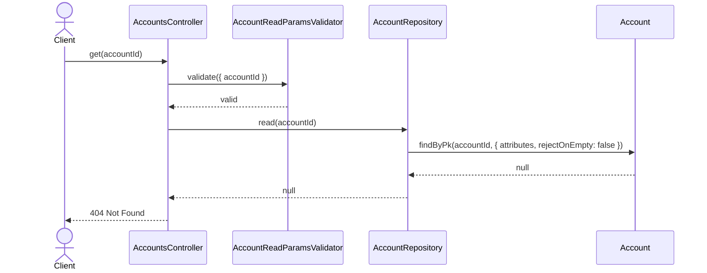
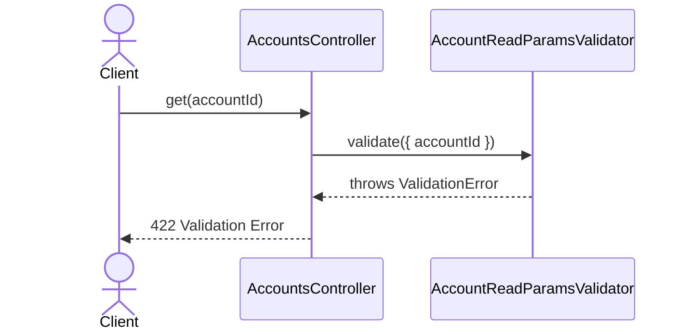

# AccountsController.get

Brief overview: Validates the account id, reads the account through `AccountRepository`, checks for a missing record in the controller, and returns the account through the final public response.

## Method

- Route: `GET /v1/accounts/:accountId`
- Signature: `AccountsController.get(accountId: number)`

## Success

## 404 Not Found

## 422 Validation Error

