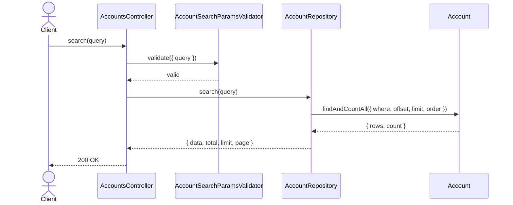
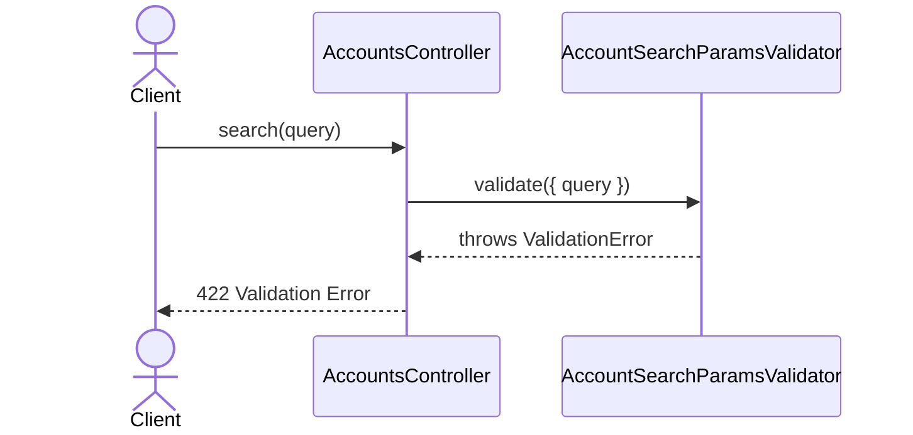

# AccountsController.search

Brief overview: Validates the GET search query, queries `AccountRepository` directly, and returns the paginated account search result using only the public response fields `id`, `orgId`, `region`, `createdAt`, `updatedAt`, `status`, `arn`, and `metadata`.

## Method

- Route: `GET /v1/accounts`
- Signature: `AccountsController.search(query: AccountSearchParamsInterface)`

## Success

## 422 Validation Error

