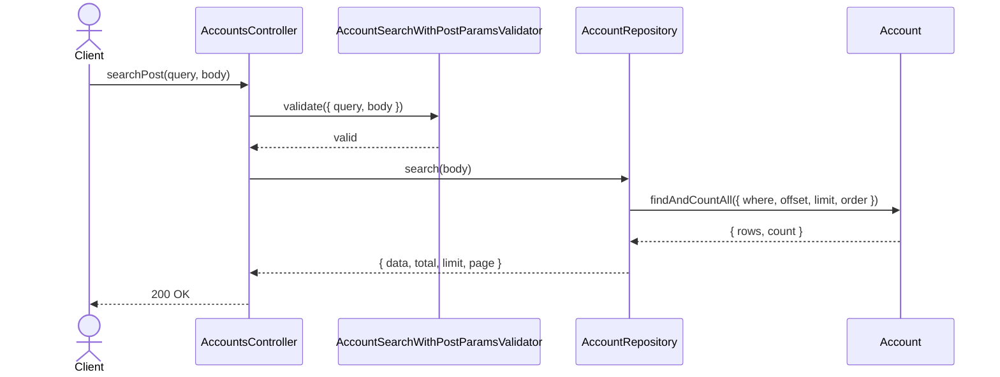
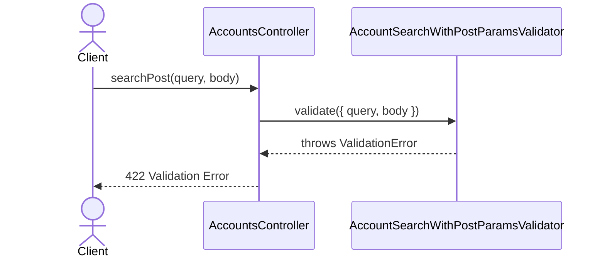

# AccountsController.searchPost

Brief overview: Validates the POST search body, passes the body directly to `AccountRepository.search(body)`, and returns the paginated account search result using only the public response fields `id`, `orgId`, `region`, `createdAt`, `updatedAt`, `status`, `arn`, and `metadata`.

## Method

- Route: `POST /v1/accounts/search`
- Signature: `AccountsController.searchPost(query: {}, body: AccountSearchParamsInterface)`

## Success

## 422 Validation Error

