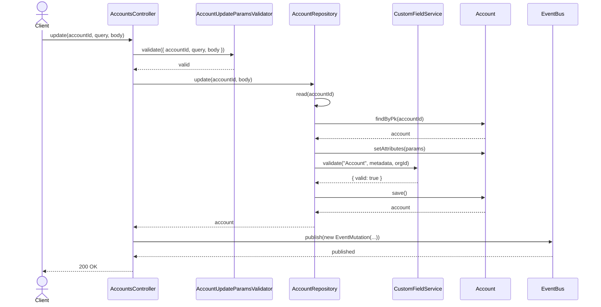
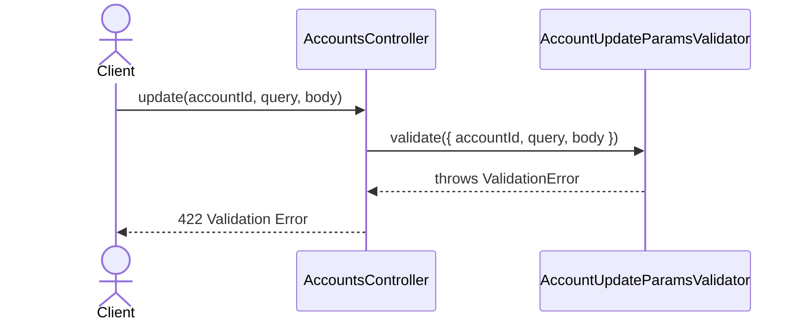
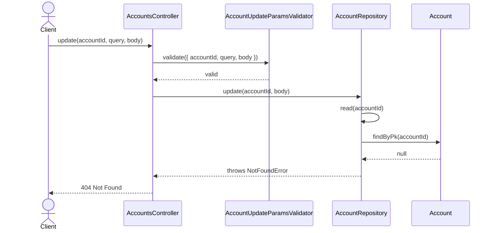
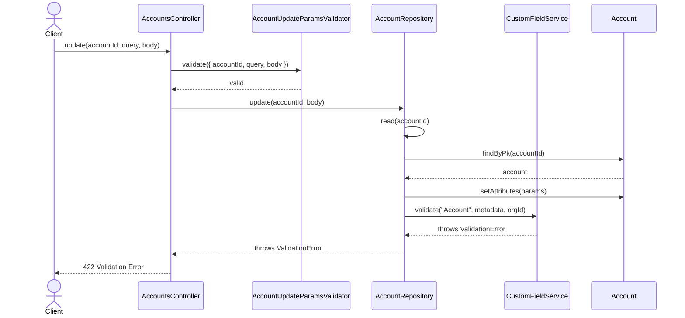

# AccountsController.update

Brief overview: Validates the update request, delegates to `AccountRepository.update`, reads the target account, mutates its attributes, validates custom fields against the current organization, saves the model, publishes an event, and returns the updated account in the final public response.

## Method

- Route: `PUT /v1/accounts/:accountId`
- Signature: `AccountsController.update(accountId: number, query: {}, body: AccountUpdateBodyInterface)`

## Success

## 422 Validation Error

## 404 Not Found

## 422 Custom Field Validation Error

