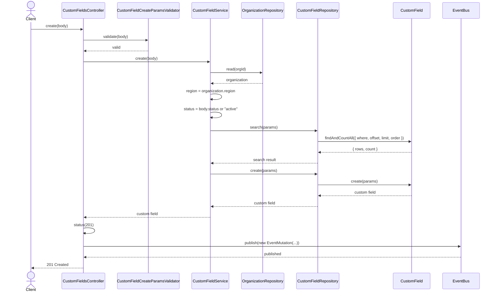
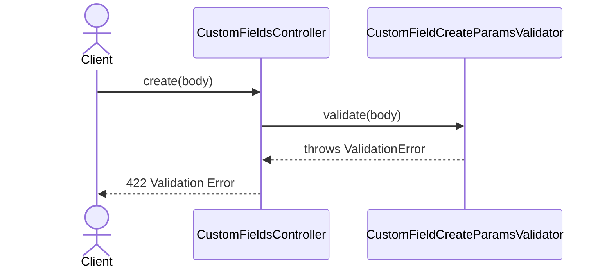
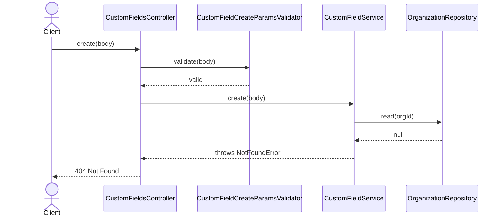
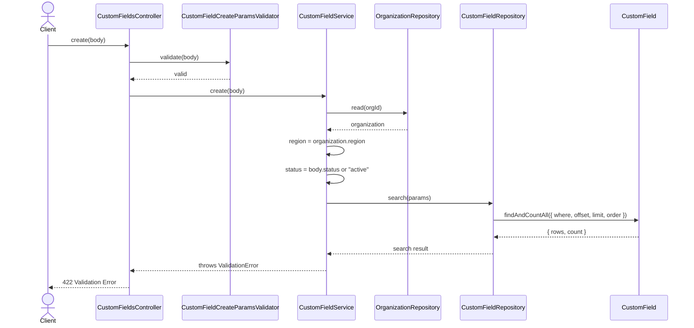

# CustomFieldsController.create

Brief overview: Validates the create request, loads the organization to derive `region`, checks for a duplicate custom field by organization, entity, and name, creates the record through `CustomFieldRepository`, publishes an event, sets `201 Created`, and returns the public custom-field attributes (`id`, `orgId`, `entity`, `title`, `name`, `schema`, `createdAt`, `updatedAt`, `status`, `arn`).

## Method

- Route: `POST /v1/custom-fields`
- Signature: `CustomFieldsController.create(query: {}, body: CustomFieldCreateBodyInterface)`

## Success

## 422 Validation Error

## 404 Organization Not Found

## 422 Duplicate Custom Field Validation Failure

