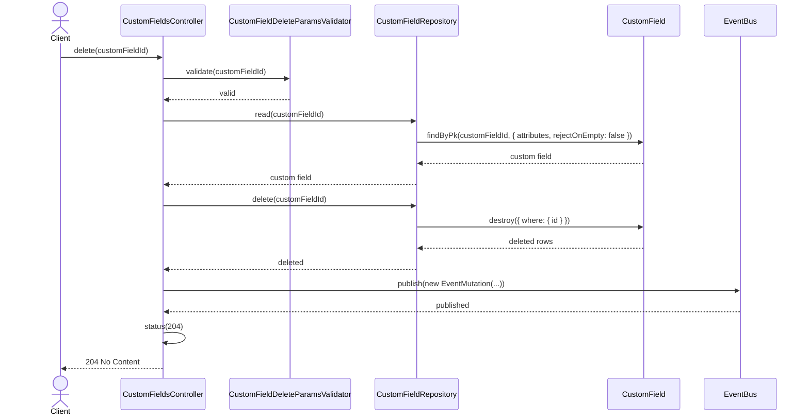
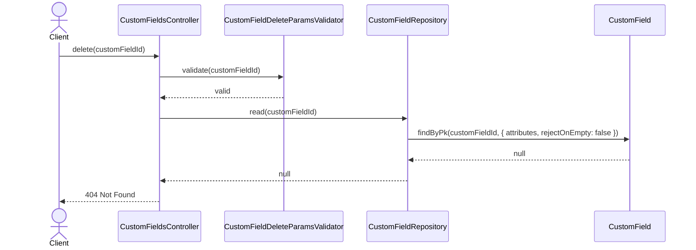
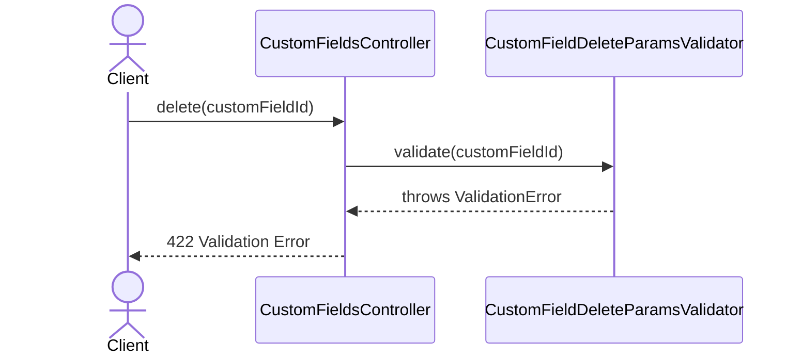

# CustomFieldsController.delete

Brief overview: Validates the path parameter, reads the custom field before deletion through `CustomFieldRepository`, deletes it through `CustomField.destroy`, publishes an event, sets `204 No Content`, and returns no body.

## Method

- Route: `DELETE /v1/custom-fields/:customFieldId`
- Signature: `CustomFieldsController.delete(customFieldId: number)`

## Success

## 404 Not Found

## 422 Validation Error

