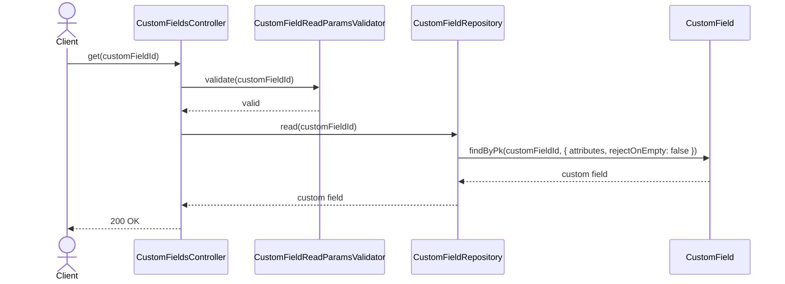
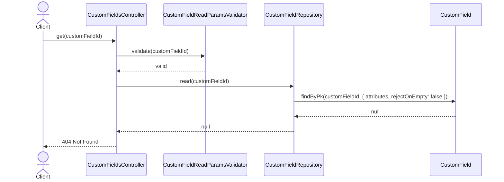
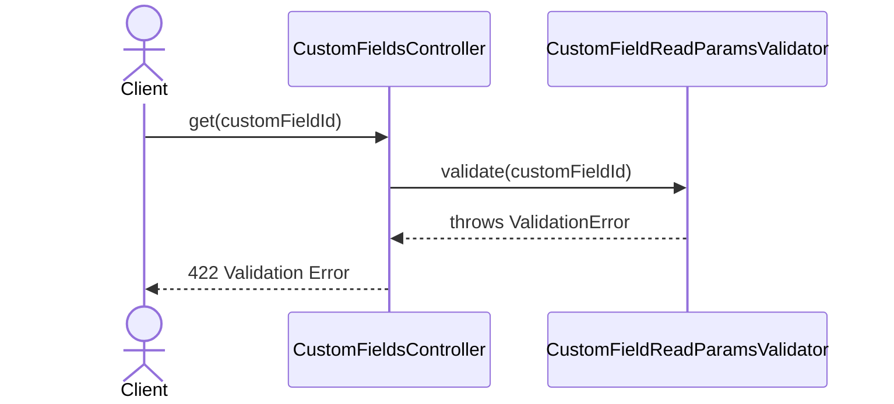

# CustomFieldsController.get

Brief overview: Validates the path parameter, reads one custom field from `CustomFieldRepository`, and returns `200 OK` when the record exists.

## Method

- Route: `GET /v1/custom-fields/:customFieldId`
- Signature: `CustomFieldsController.get(customFieldId: number)`

## Success

## 404 Not Found

## 422 Validation Error

