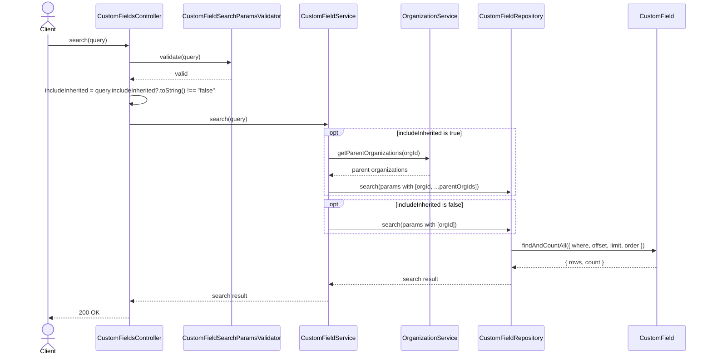
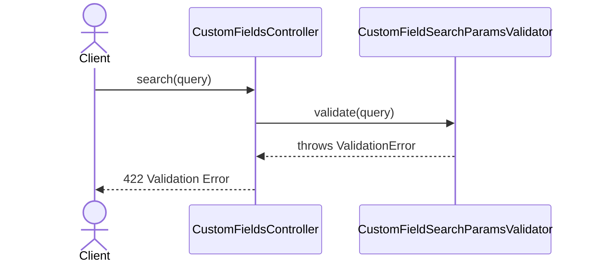

# CustomFieldsController.search

Brief overview: Validates the search query, normalizes `includeInherited` in the controller, optionally expands the organization scope through `OrganizationService`, searches through `CustomFieldRepository`, and returns `200 OK`.

## Method

- Route: `GET /v1/custom-fields`
- Signature: `CustomFieldsController.search(query: CustomFieldSearchParamsInterface)`

## Success

## 422 Validation Error

