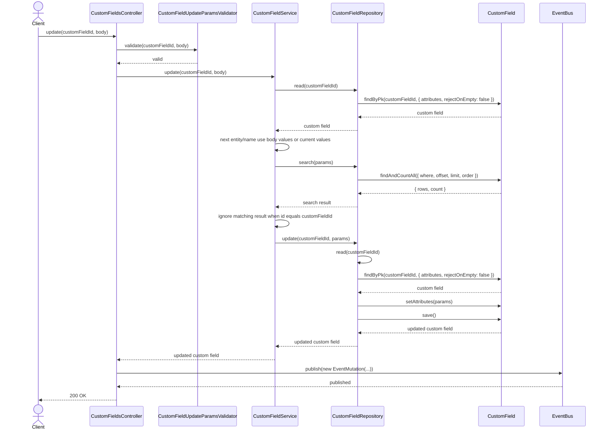
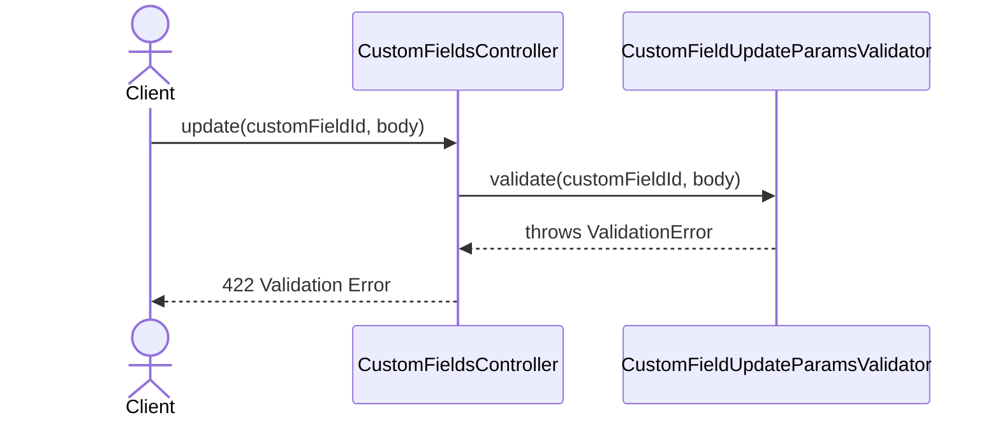
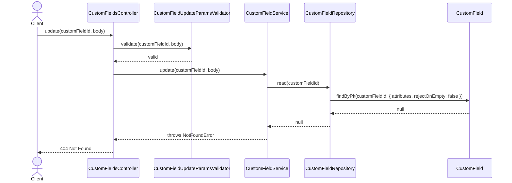
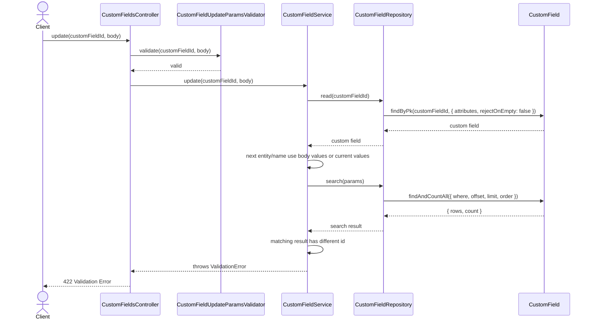

# CustomFieldsController.update

Brief overview: Validates the update request, checks that the custom field exists, resolves duplicate conflicts with the next `entity` and `name` values, updates through `CustomFieldRepository`, publishes an event, and returns `200 OK` with the public custom-field attributes (`id`, `orgId`, `entity`, `title`, `name`, `schema`, `createdAt`, `updatedAt`, `status`, `arn`).

## Method

- Route: `PUT /v1/custom-fields/:customFieldId`
- Signature: `CustomFieldsController.update(customFieldId: number, query: {}, body: CustomFieldUpdateBodyInterface)`

## Success

## 422 Validation Error

## 404 Not Found

## 422 Duplicate Custom Field Validation Failure

