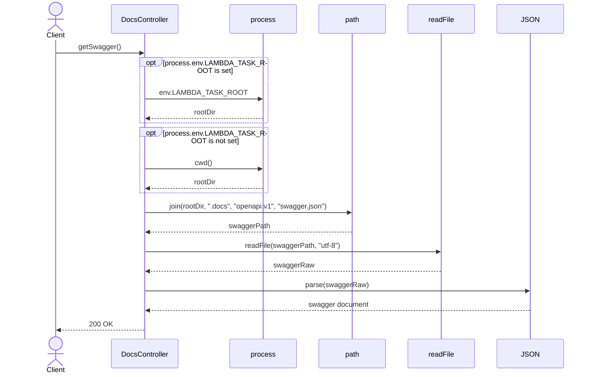
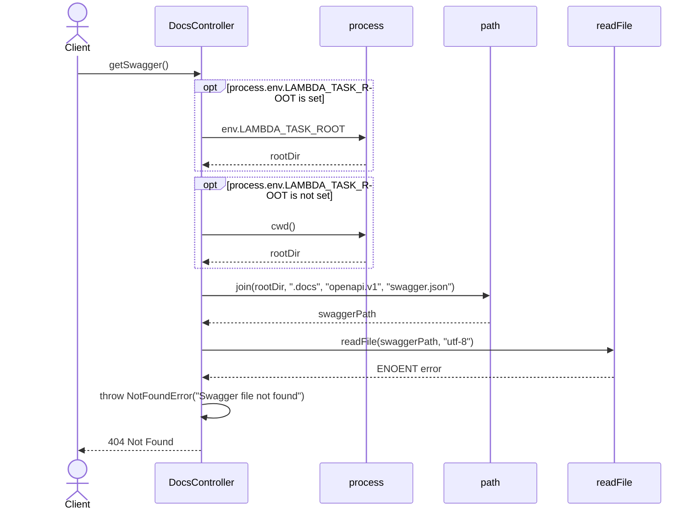
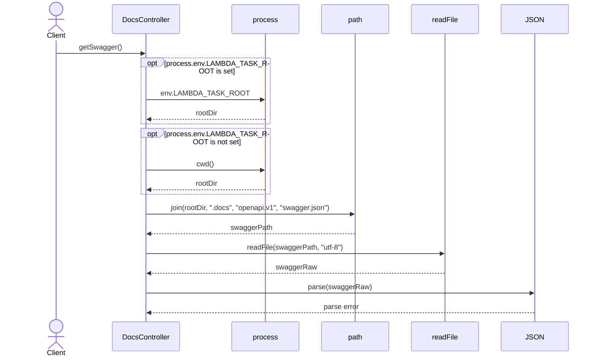
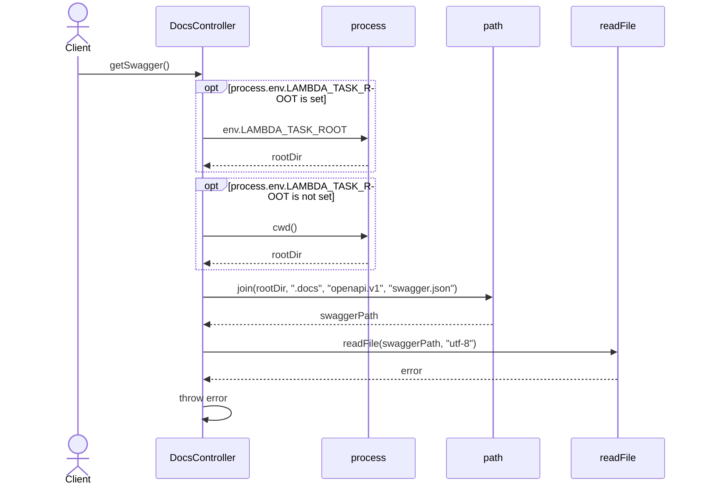

# DocsController.getSwagger

Brief overview: публичный `GET /v1/docs/swagger.json` доступен без security middleware только потому, что в контроллере явно указан `@NoSecurity()`. Метод `getSwagger()` определяет runtime root directory через `process.env.LAMBDA_TASK_ROOT || process.cwd()`, строит путь к Swagger-файлу, читает `.docs/openapi.v1/swagger.json` и возвращает `200 OK` после `JSON.parse(swaggerRaw)`.

## Method

Route: `GET /v1/docs/swagger.json`  
Controller method: `DocsController.getSwagger()`

## Success

## 404 Not Found

## Invalid JSON Parse Failure

## File Read Failure

