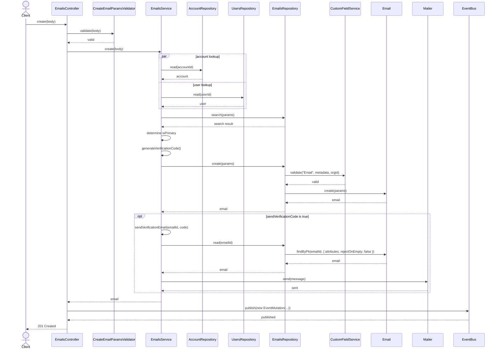
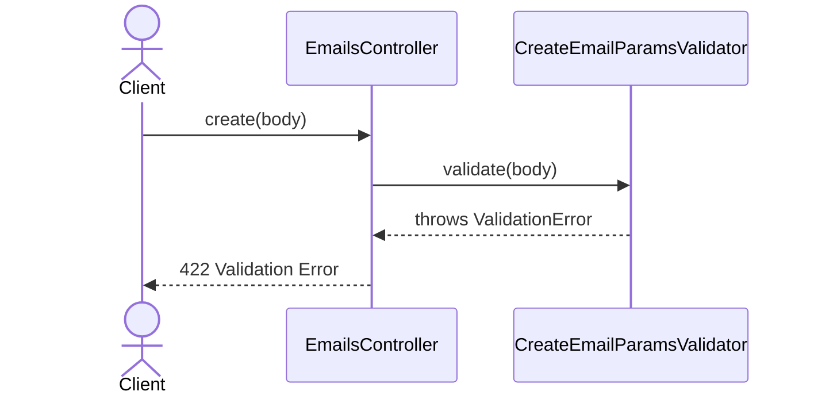
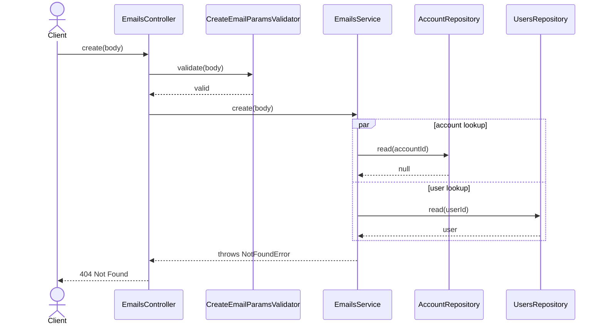
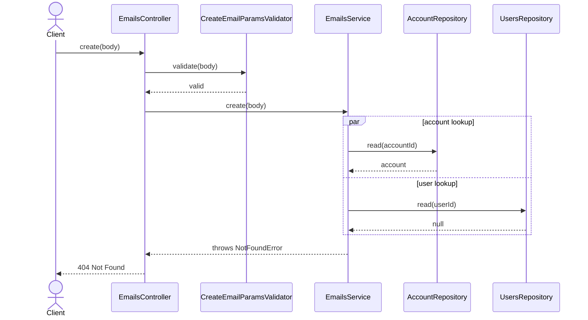
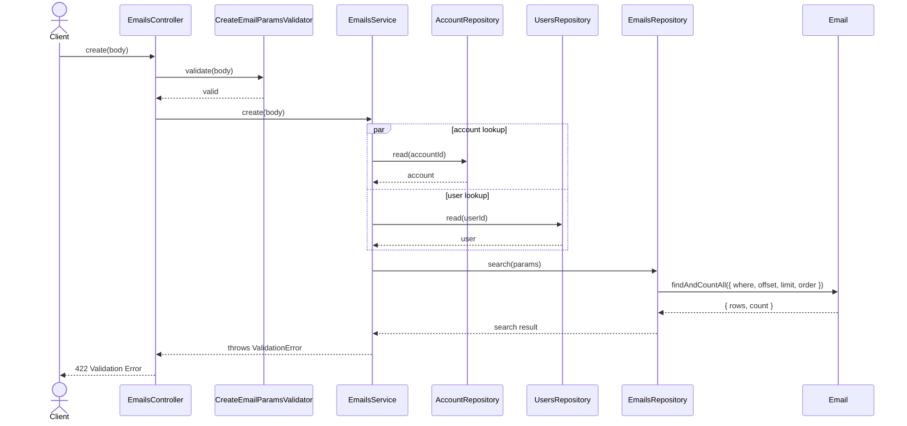
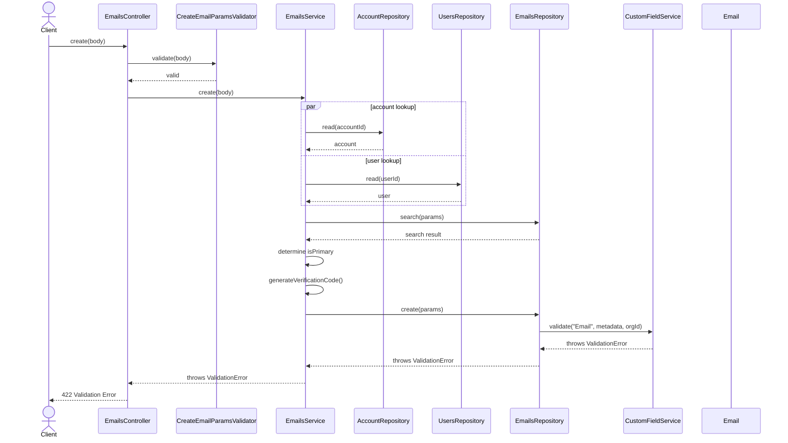

# EmailsController.create

Brief overview: Validates the create request, delegates to `EmailsService` for account and user lookup, checks for duplicate emails and primary-email state, creates the email through `EmailsRepository` with custom field validation, optionally sends a verification email, publishes an event, and returns `201 Created`.

## Method

- Route: `POST /v1/emails`
- Signature: `EmailsController.create(query: {}, body: EmailCreateBodyInterface)`

## Success

## 422 Validation Error

## 404 Account Not Found

## 404 User Not Found

## 422 Duplicate Email Validation Failure

## 422 Custom Field Validation Failure

