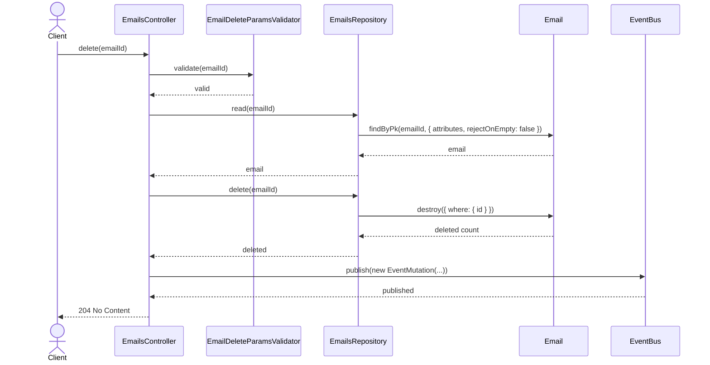
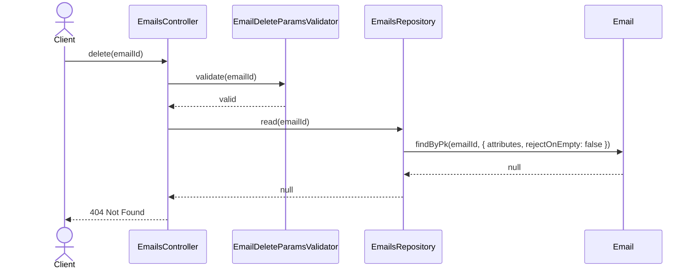
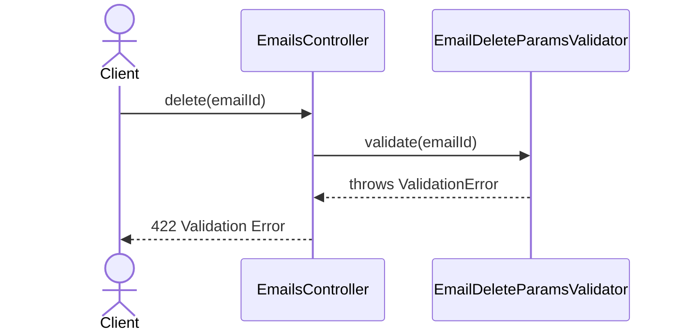

# EmailsController.delete

Brief overview: Validates the path parameter, reads the email before deletion through `EmailsRepository`, deletes it, publishes an event, and finishes with `204 No Content`.

## Method

- Route: `DELETE /v1/emails/:emailId`
- Signature: `EmailsController.delete(emailId: number)`

## Success

## 404 Not Found

## 422 Validation Error

