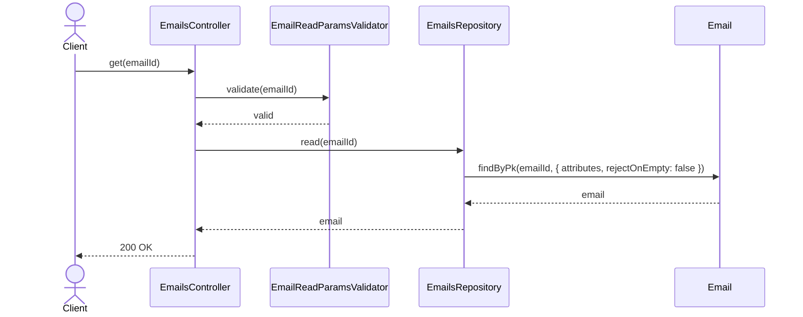
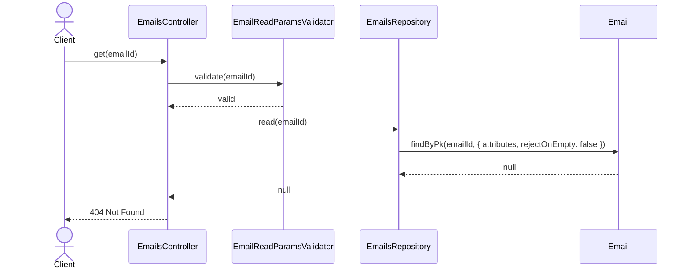
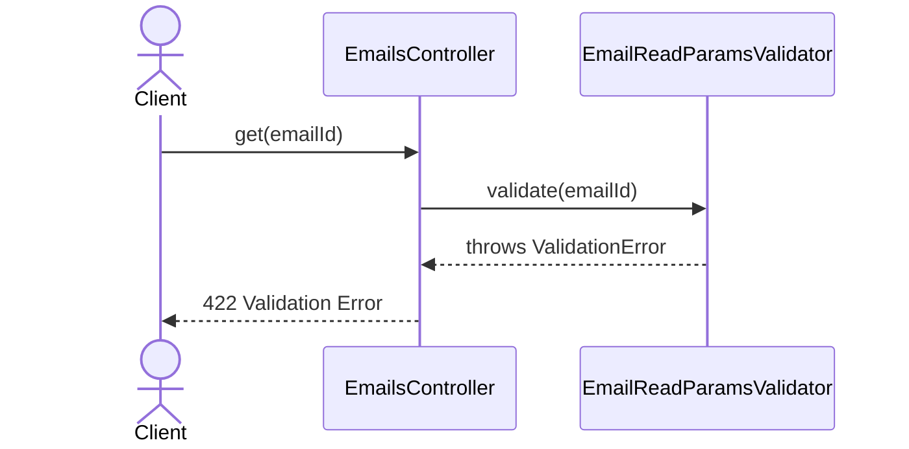

# EmailsController.get

Brief overview: Validates the path parameter, reads one email from `EmailsRepository`, and returns `200 OK` when the record exists.

## Method

- Route: `GET /v1/emails/:emailId`
- Signature: `EmailsController.get(emailId: number)`

## Success

## 404 Not Found

## 422 Validation Error

