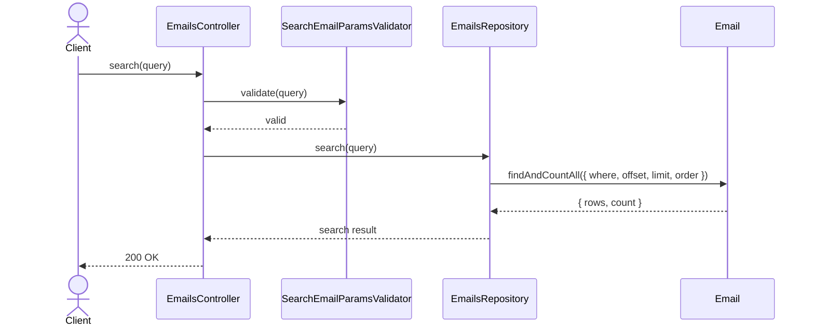
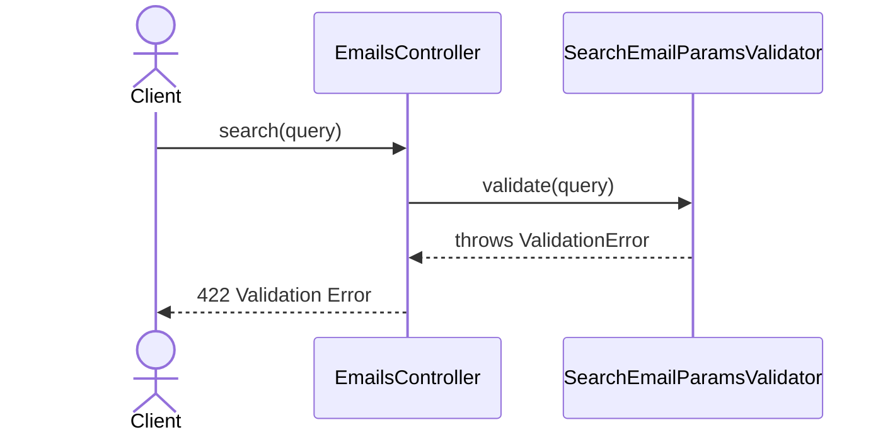

# EmailsController.search

Brief overview: Validates the GET search query, queries `EmailsRepository` directly, and returns `200 OK` when the paginated email search completes successfully.

## Method

- Route: `GET /v1/emails`
- Signature: `EmailsController.search(query: EmailSearchParamsInterface)`

## Success

## 422 Validation Error

