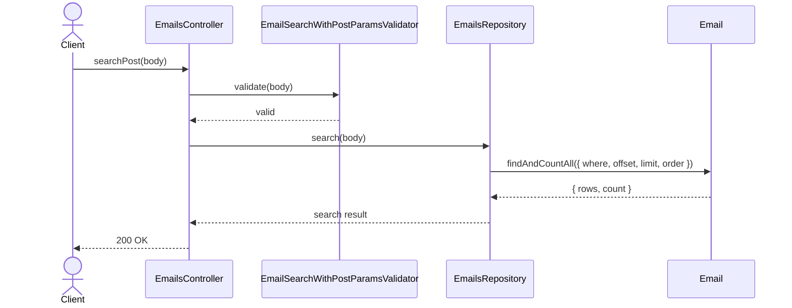
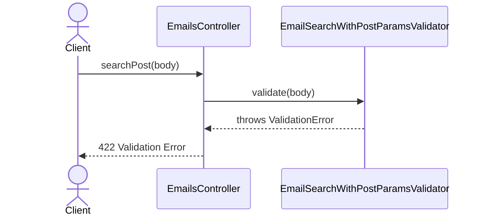

# EmailsController.searchPost

Brief overview: Validates the POST search body, queries `EmailsRepository` directly, and returns `200 OK` when the paginated email search completes successfully.

## Method

- Route: `POST /v1/emails/search`
- Signature: `EmailsController.searchPost(query: {}, body: EmailSearchParamsInterface)`

## Success

## 422 Validation Error

