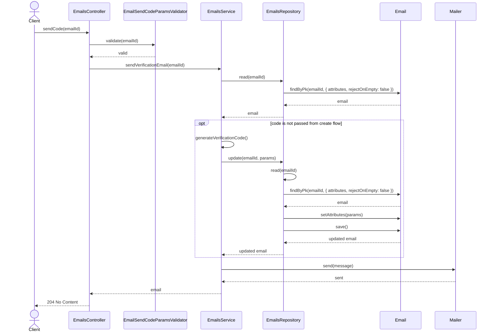
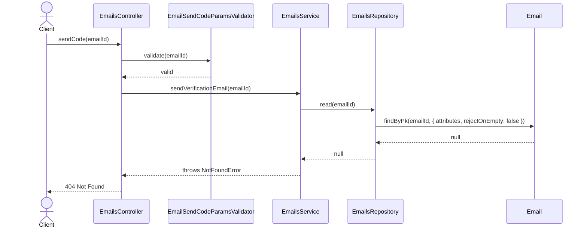
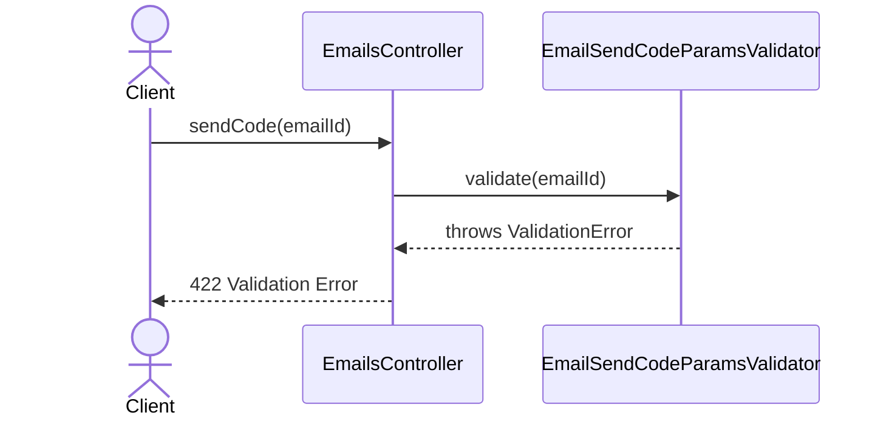

# EmailsController.sendCode

Brief overview: Validates the path parameter, delegates to `EmailsService` to read the email, optionally generates and stores a new verification code, sends the email through `Mailer`, and finishes with `204 No Content`.

## Method

- Route: `POST /v1/emails/:emailId/send-code`
- Signature: `EmailsController.sendCode(emailId: number)`

## Success

## 404 Not Found

## 422 Validation Error

