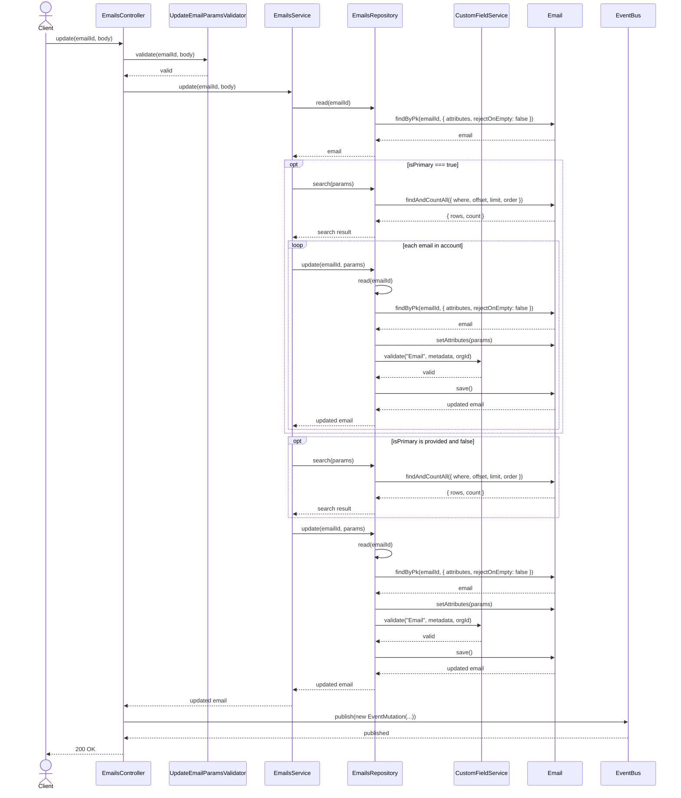
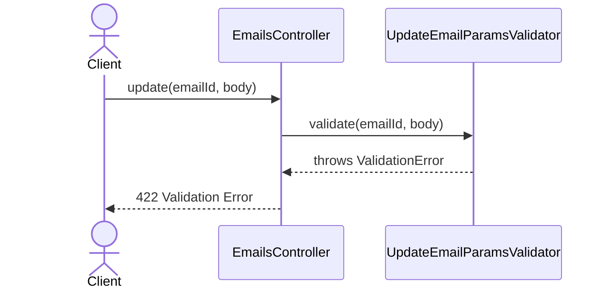
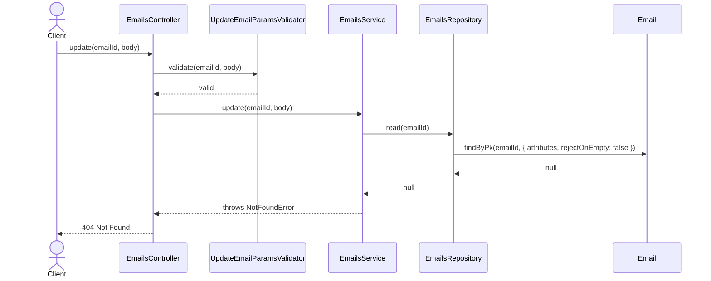
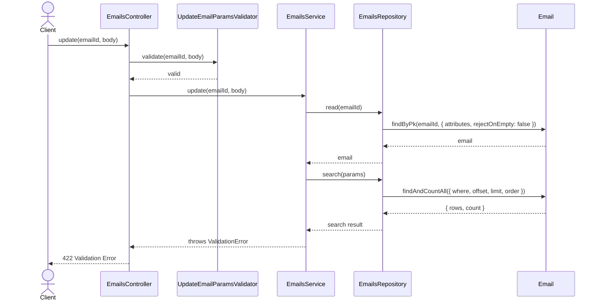
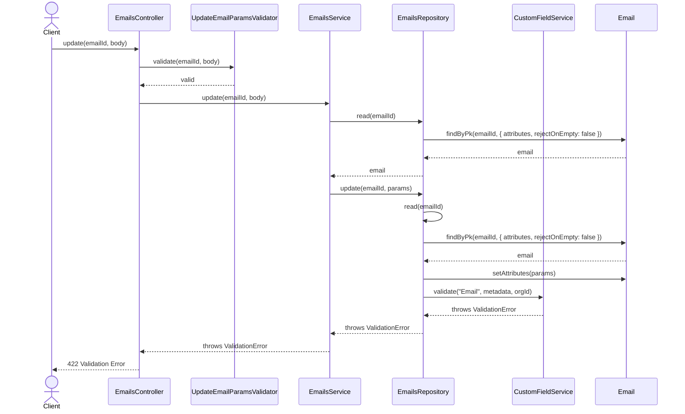

# EmailsController.update

Brief overview: Validates the update request, delegates to `EmailsService`, checks that the target email exists, optionally reassigns primary-email state, updates through `EmailsRepository` with custom field validation, publishes an event, and returns `200 OK`.

## Method

- Route: `PUT /v1/emails/:emailId`
- Signature: `EmailsController.update(emailId: number, query: {}, body: EmailUpdateBodyInterface)`

## Success

## 422 Validation Error

## 404 Not Found

## 422 One Primary Email Validation Failure

## 422 Custom Field Validation Failure

