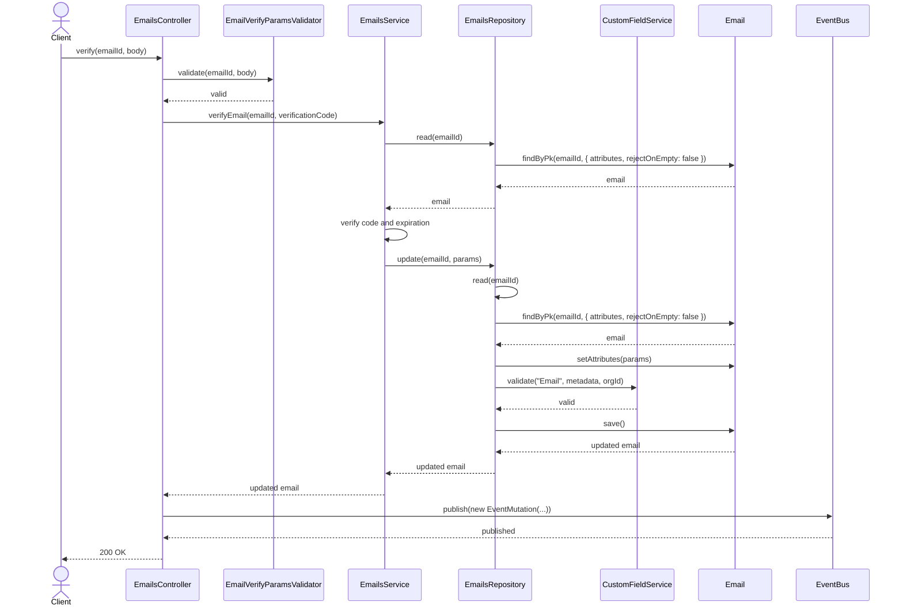
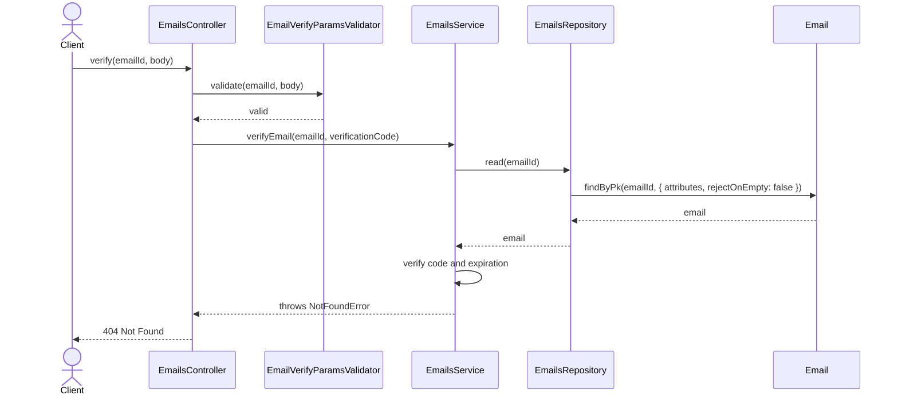
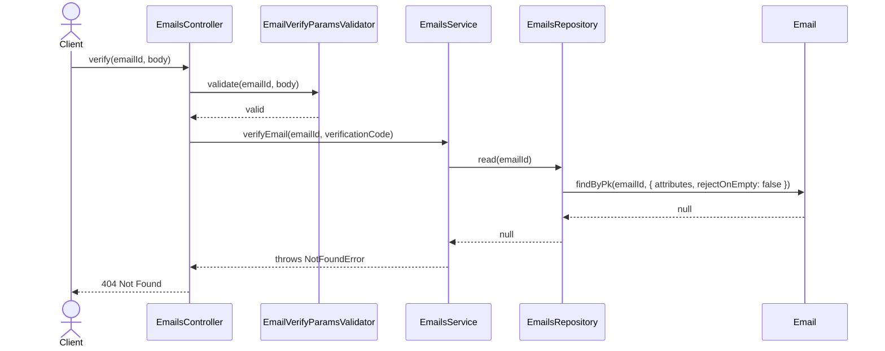
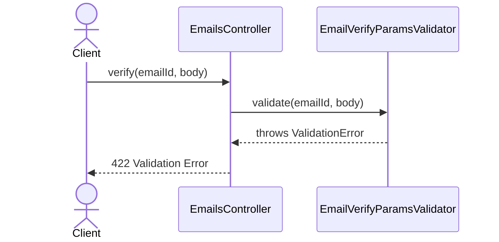

# EmailsController.verify

Brief overview: Validates the verification request, delegates to `EmailsService.verifyEmail`, reads the email, checks the verification code and expiration in the service, updates the record through `EmailsRepository`, publishes an event, and returns `200 OK`.

## Method

- Route: `POST /v1/emails/:emailId/verify`
- Signature: `EmailsController.verify(emailId: number, query: {}, body: EmailVerifyBodyInterface)`

## Success

## 404 Invalid Or Expired Verification Code

## 404 Not Found

## 422 Validation Error

