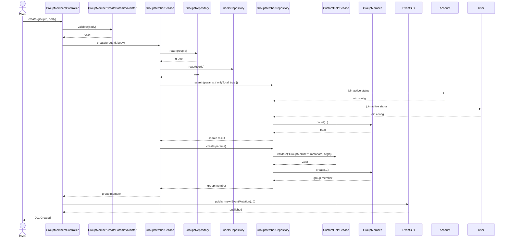
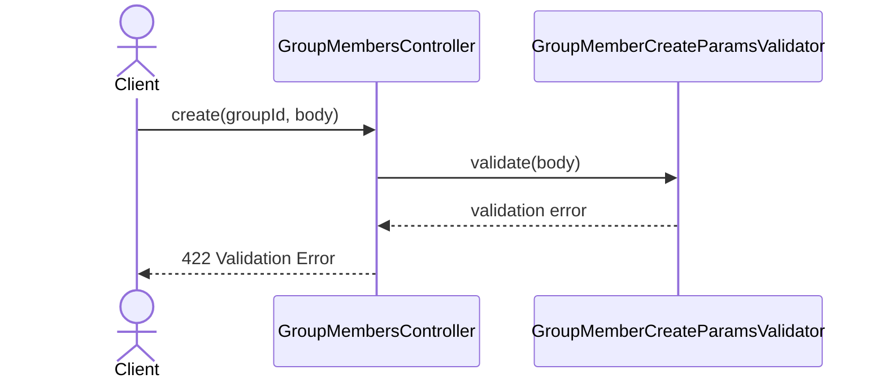
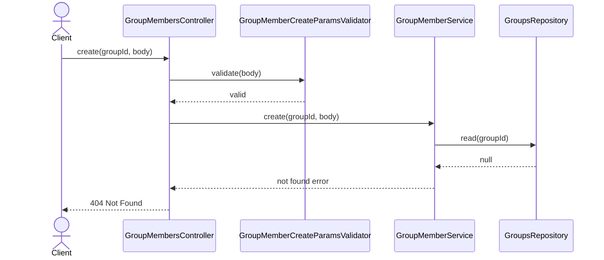
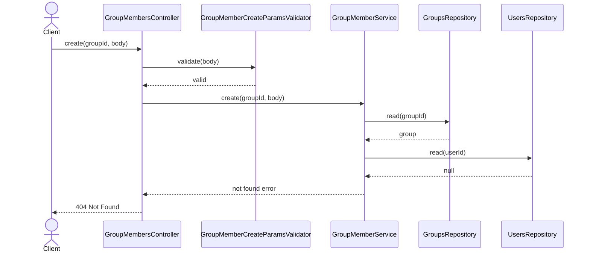
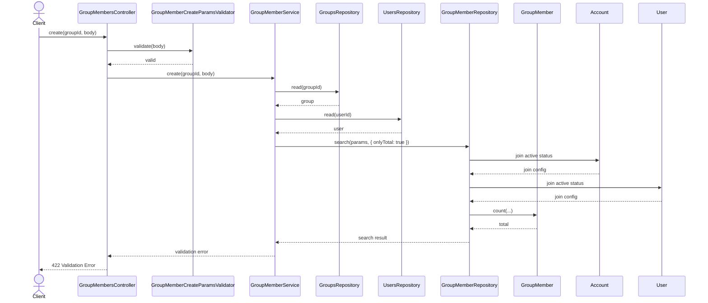
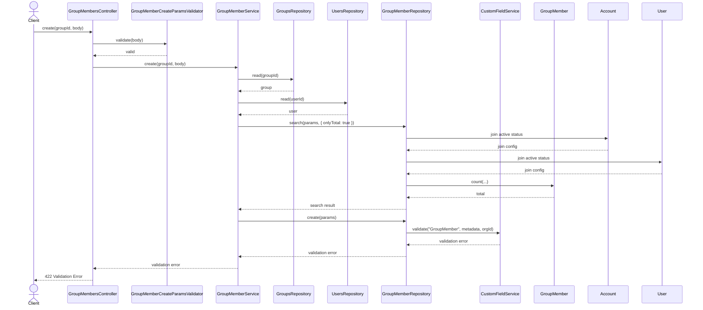

# GroupMembersController.create

Brief overview: создание участника группы валидирует входные данные, проверяет существование группы и пользователя, делает проверку на дублирующее членство через поиск `onlyTotal`, затем создаёт запись с валидацией custom fields и публикует событие.

## Method

`POST /v1/groups/:groupId/members -> create(groupId, body)`

## Success

## 422 Validation Error

## 404 Not Found Group Not Found

## 404 Not Found User Not Found

## 422 Validation Error Duplicate Membership

## 422 Validation Error Custom Field Validation Failure

