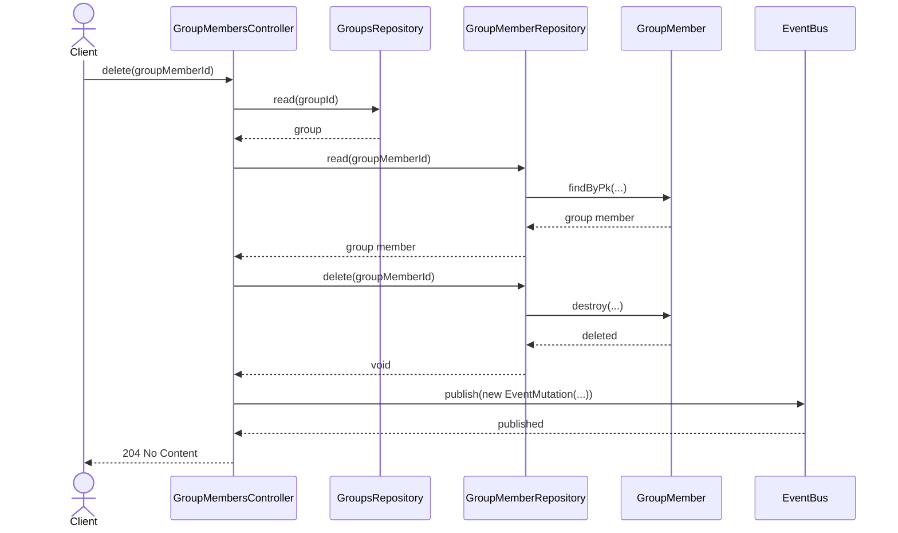
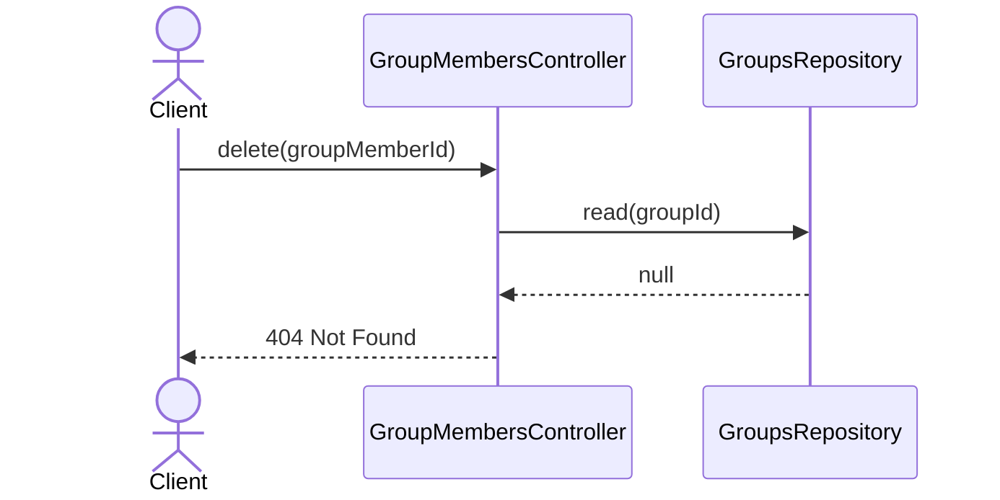
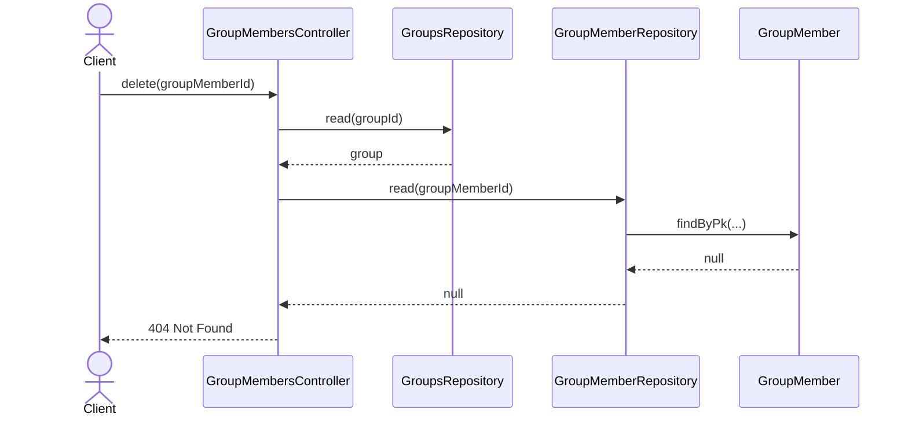

# GroupMembersController.delete

Brief overview: удаление участника группы сначала проверяет родительскую группу, затем читает целевого участника, удаляет запись через репозиторий, публикует событие и завершает запрос статусом `204 No Content`.

## Method

`DELETE /v1/groups/:groupId/members/:groupMemberId -> delete(groupId, groupMemberId)`

## Success

## 404 Not Found Group Not Found

## 404 Not Found Group Member Not Found

