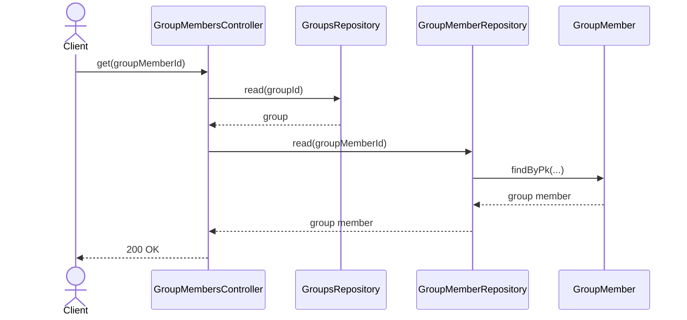
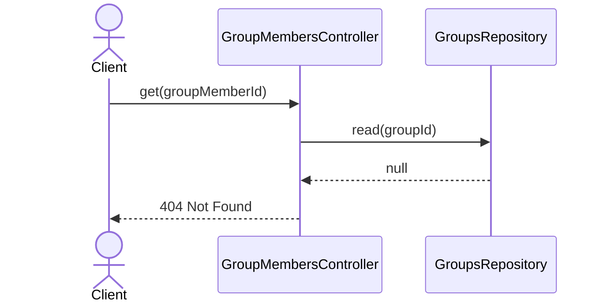
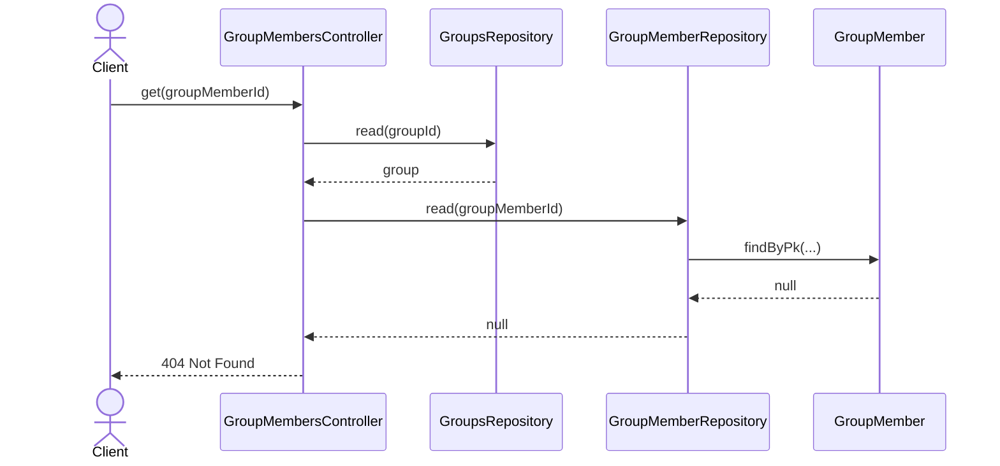

# GroupMembersController.get

Brief overview: чтение участника группы сначала проверяет существование родительской группы через `GroupsRepository.read`, затем читает участника через `GroupMemberRepository.read` и возвращает публичные атрибуты.

## Method

`GET /v1/groups/:groupId/members/:groupMemberId -> get(groupId, groupMemberId)`

## Success

## 404 Not Found Group Not Found

## 404 Not Found Group Member Not Found

