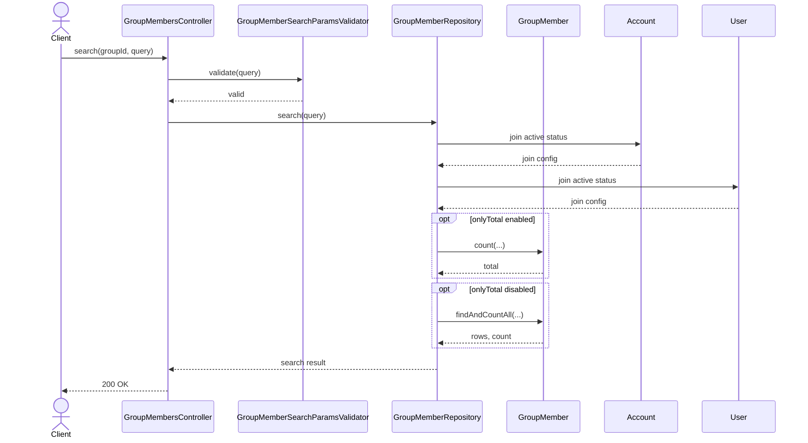
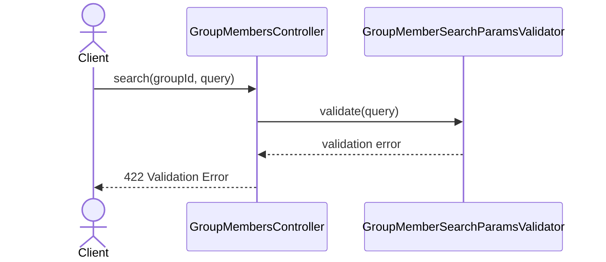

# GroupMembersController.search

Brief overview: GET-поиск участников группы валидирует query-параметры, принудительно добавляет `groupId` из route-контекста и передаёт поиск в `GroupMemberRepository`, который всегда фильтрует связанные `Account` и `User` по активному статусу.

## Method

`GET /v1/groups/:groupId/members -> search(groupId, query)`

## Success

## 422 Validation Error

