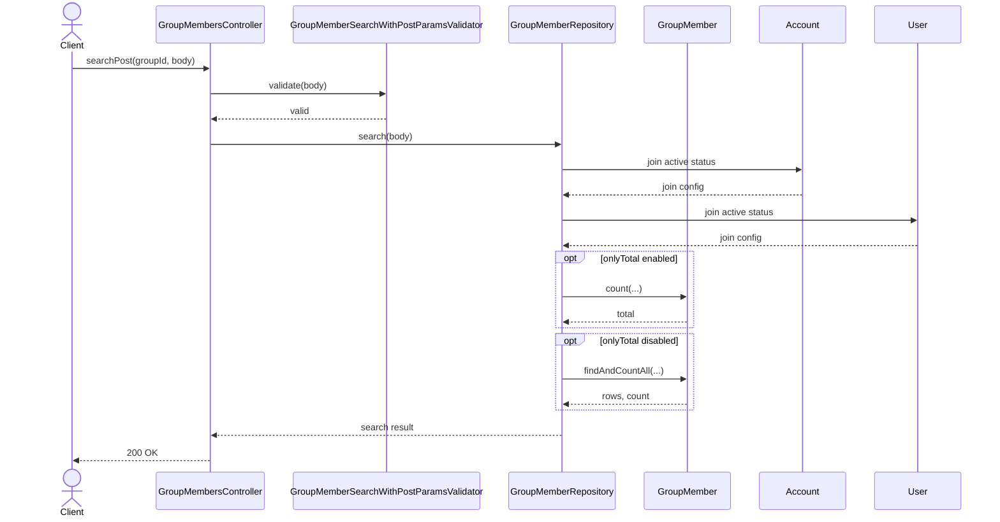
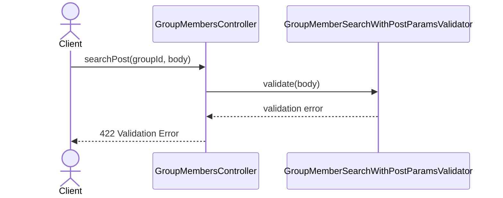

# GroupMembersController.searchPost

Brief overview: POST-поиск участников группы валидирует тело запроса, добавляет `groupId` из route-контекста и использует тот же `GroupMemberRepository.search`, включая обязательные join-фильтры по активным `Account` и `User`.

## Method

`POST /v1/groups/:groupId/members/search -> searchPost(groupId, body)`

## Success

## 422 Validation Error

