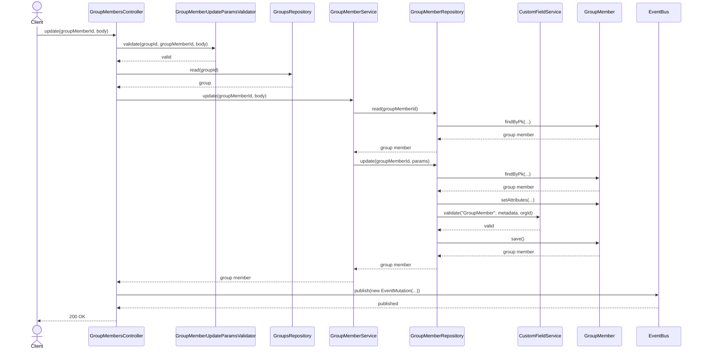
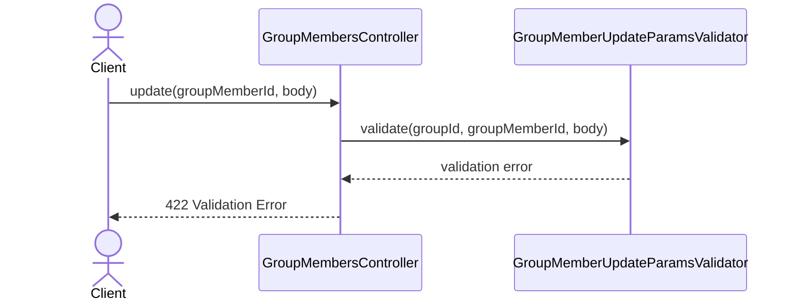
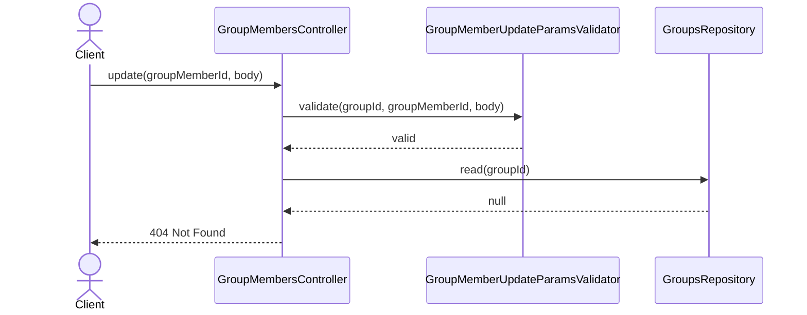
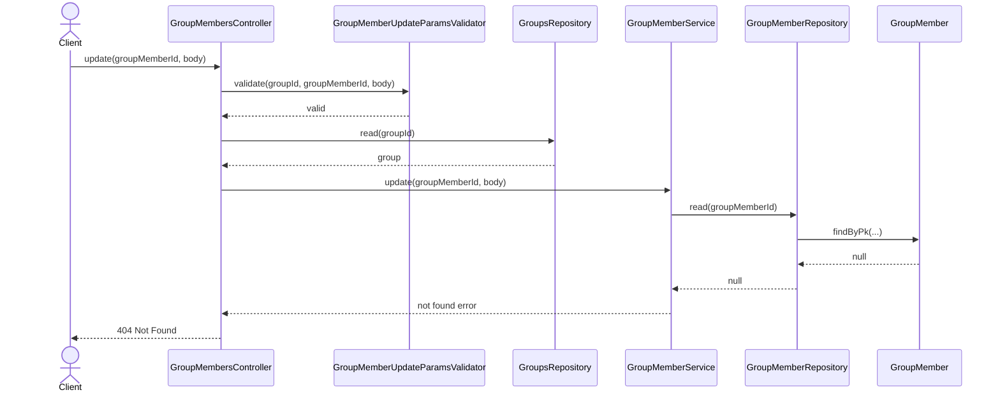
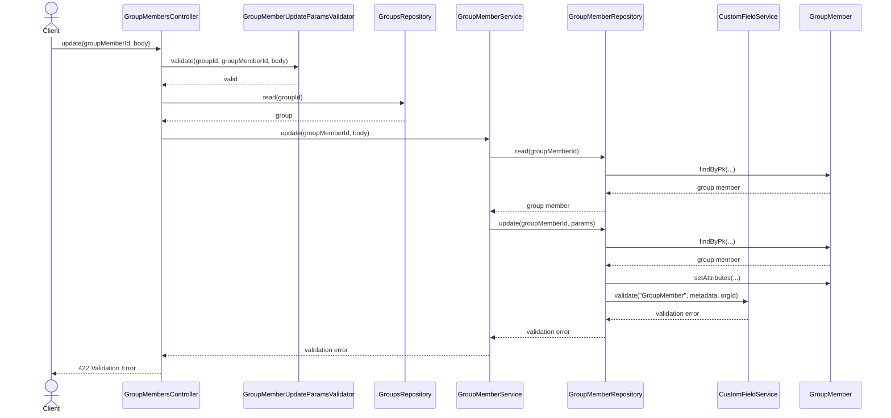

# GroupMembersController.update

Brief overview: обновление участника группы валидирует входные данные, проверяет родительскую группу в контроллере, затем сервис повторно читает участника, репозиторий отбрасывает `undefined`, валидирует custom fields, сохраняет модель и после этого публикуется событие.

## Method

`PUT /v1/groups/:groupId/members/:groupMemberId -> update(groupId, groupMemberId, body)`

## Success

## 422 Validation Error

## 404 Not Found Group Not Found

## 404 Not Found Group Member Not Found

## 422 Validation Error Custom Field Validation Failure

