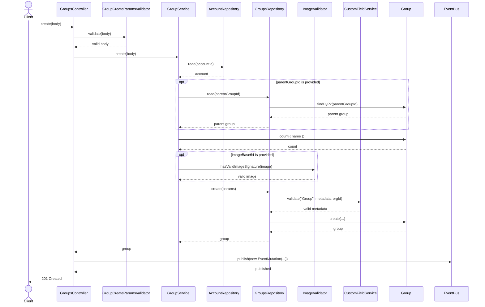
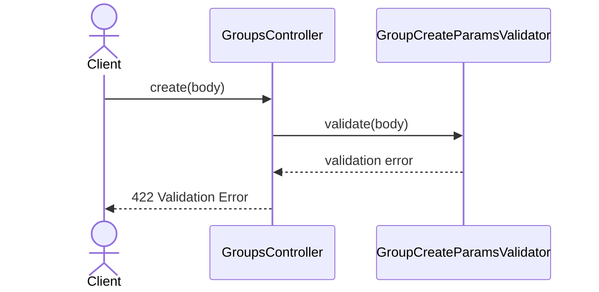
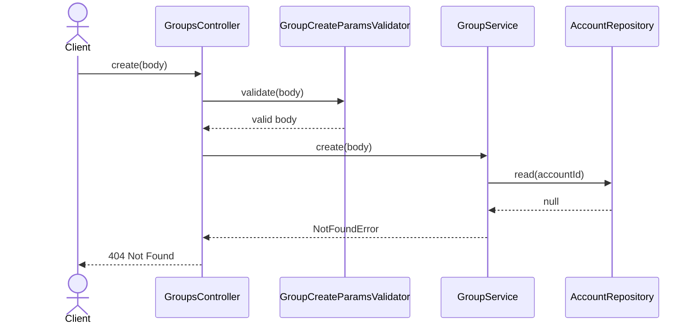
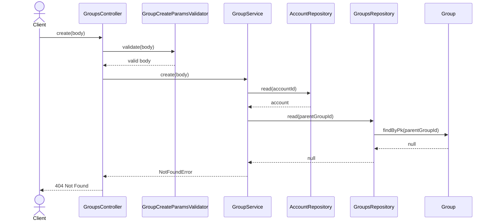
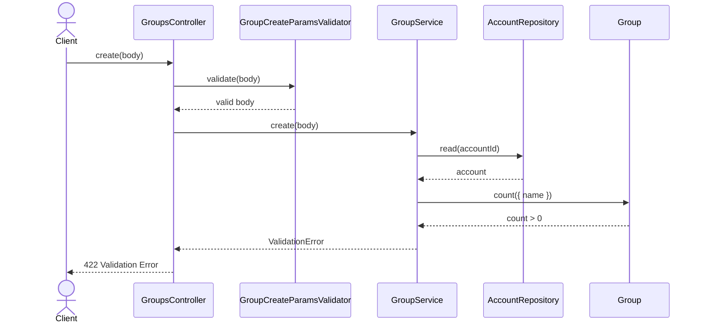
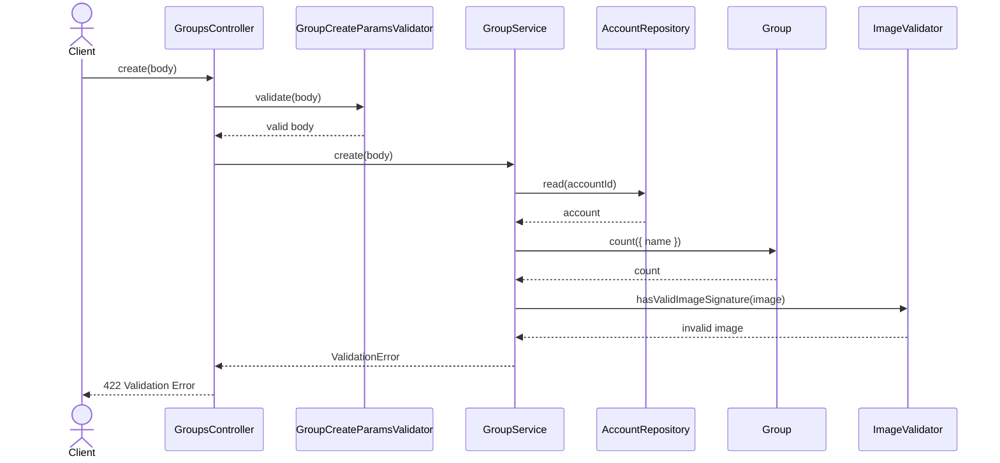
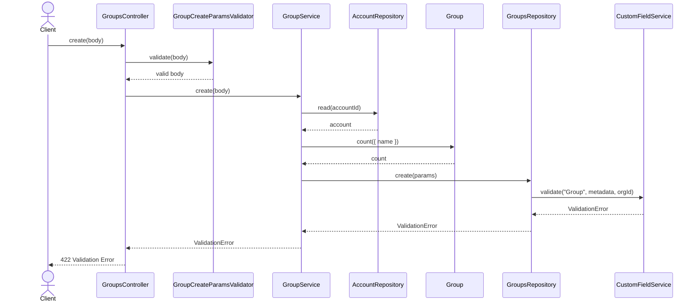

# GroupsController.create

Brief overview: `POST /v1/groups` validates the body with `GroupCreateParamsValidator`, then `GroupService.create(body)` resolves the account, optionally resolves the parent group, builds a slugged name from `title`, rejects duplicate names globally, optionally validates image signature, and delegates persistence to `GroupsRepository.create(params)`. The repository validates custom fields before `Group.create(...)`. On success the controller switches the response to `201 Created` and publishes an event.

## Method

Route: `POST /v1/groups`  
Controller method: `GroupsController.create(body)`

## Success

## 422 Validation Error

## 404 Account Not Found

## 404 Parent Group Not Found

## 422 Duplicate Name Validation Failure

## 422 Invalid Image Validation Failure

## 422 Custom Field Validation Failure

