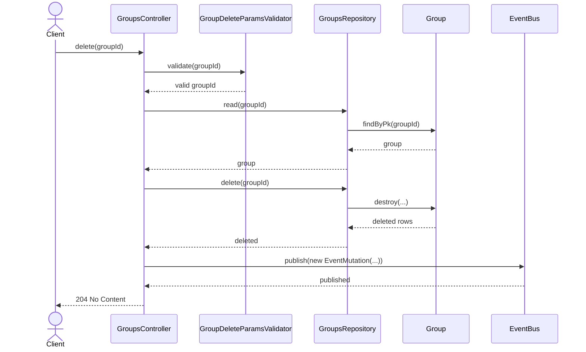
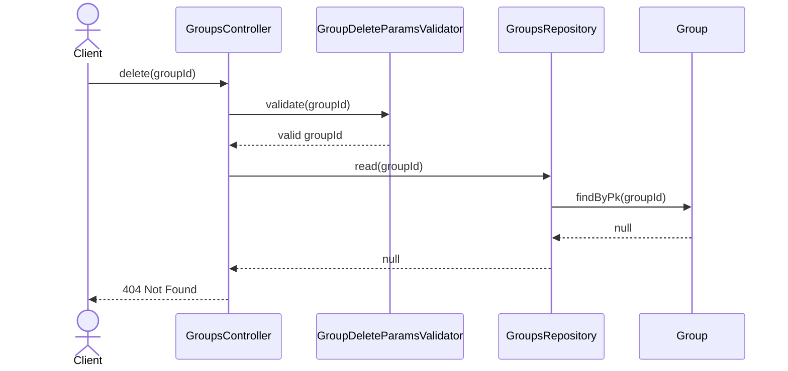
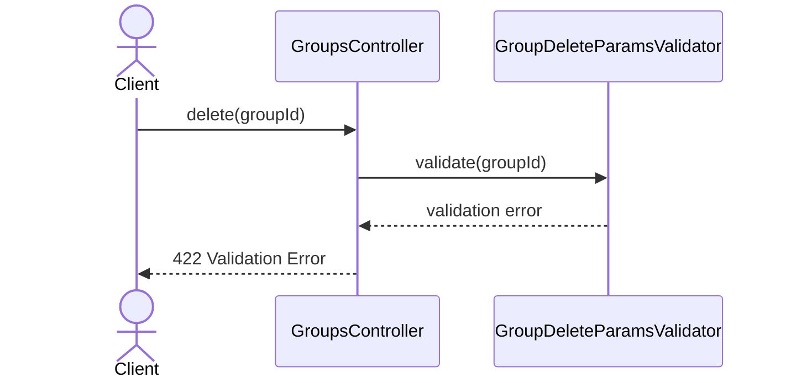

# GroupsController.delete

Brief overview: `DELETE /v1/groups/:groupId` validates the path with `GroupDeleteParamsValidator`, reads the group before deletion, deletes it through `GroupsRepository.delete(groupId)`, publishes an event, and switches the response to `204 No Content`.

## Method

Route: `DELETE /v1/groups/:groupId`  
Controller method: `GroupsController.delete(groupId)`

## Success

## 404 Not Found

## 422 Validation Error

