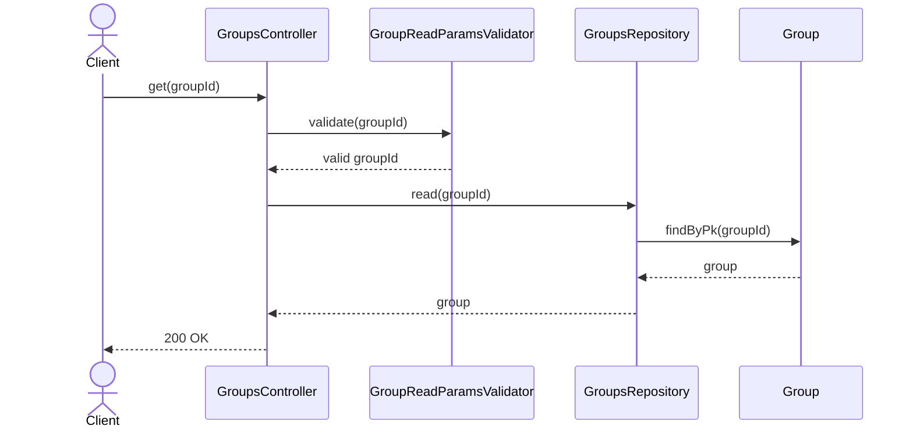
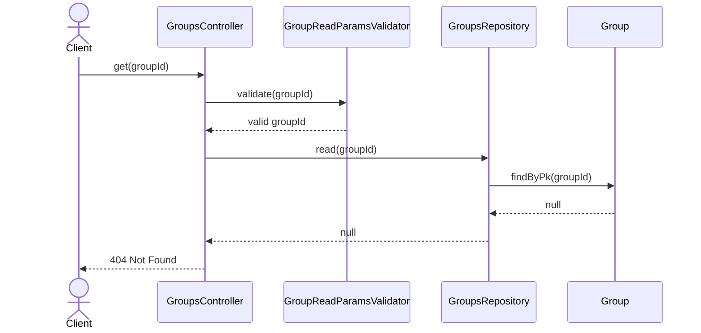
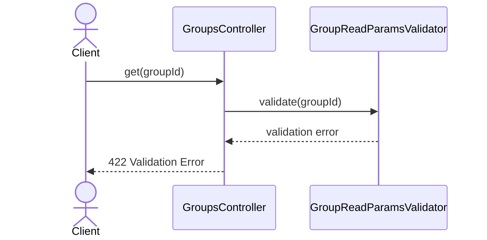

# GroupsController.get

Brief overview: `GET /v1/groups/:groupId` validates the path with `GroupReadParamsValidator`, reads the group through `GroupsRepository.read(groupId)`, and returns `200 OK` when the record exists. If no record is found, the controller raises `NotFoundError`.

## Method

Route: `GET /v1/groups/:groupId`  
Controller method: `GroupsController.get(groupId)`

## Success

## 404 Not Found

## 422 Validation Error

