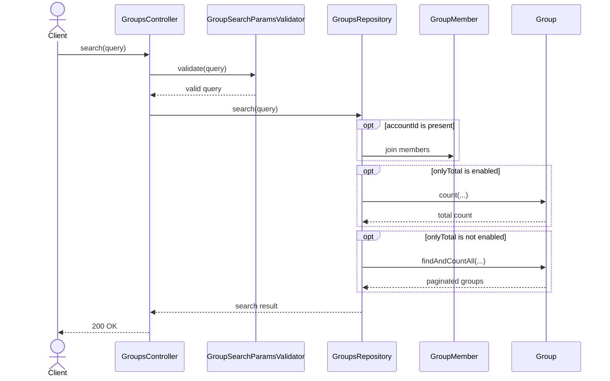
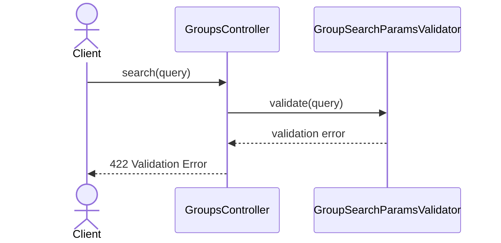

# GroupsController.search

Brief overview: `GET /v1/groups` validates query params with `GroupSearchParamsValidator`, normalizes `includeOwner` in `GroupsController`, then calls `GroupsRepository.search(query)`. When `accountId` is present, the repository joins `GroupMember` and applies account filtering internally based on `includeOwner`. Inside the repository, `onlyTotal` can switch the model call from `findAndCountAll(...)` to `count(...)`. On success the controller returns `200 OK`.

## Method

Route: `GET /v1/groups`  
Controller method: `GroupsController.search(query)`

## Success

## 422 Validation Error

