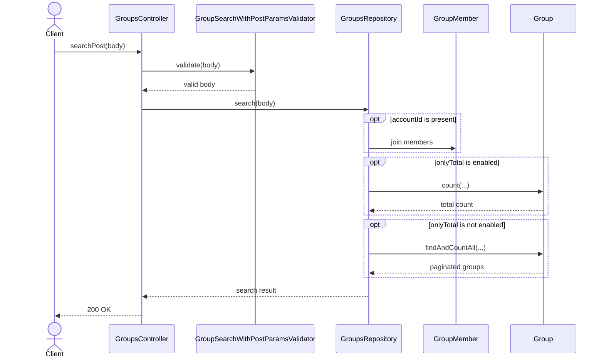
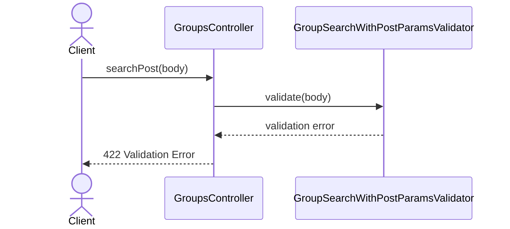

# GroupsController.searchPost

Brief overview: `POST /v1/groups/search` validates request body with `GroupSearchWithPostParamsValidator` and forwards the body to `GroupsRepository.search(body)` without controller-side `includeOwner` normalization. When `accountId` is present, the repository joins `GroupMember` and applies account filtering internally based on `includeOwner`. Inside the repository, `onlyTotal` can switch the model call from `findAndCountAll(...)` to `count(...)`. On success the controller returns `200 OK`; unlike GET search, the final mapped response omits `imageUrl`.

## Method

Route: `POST /v1/groups/search`  
Controller method: `GroupsController.searchPost(body)`

## Success

## 422 Validation Error

