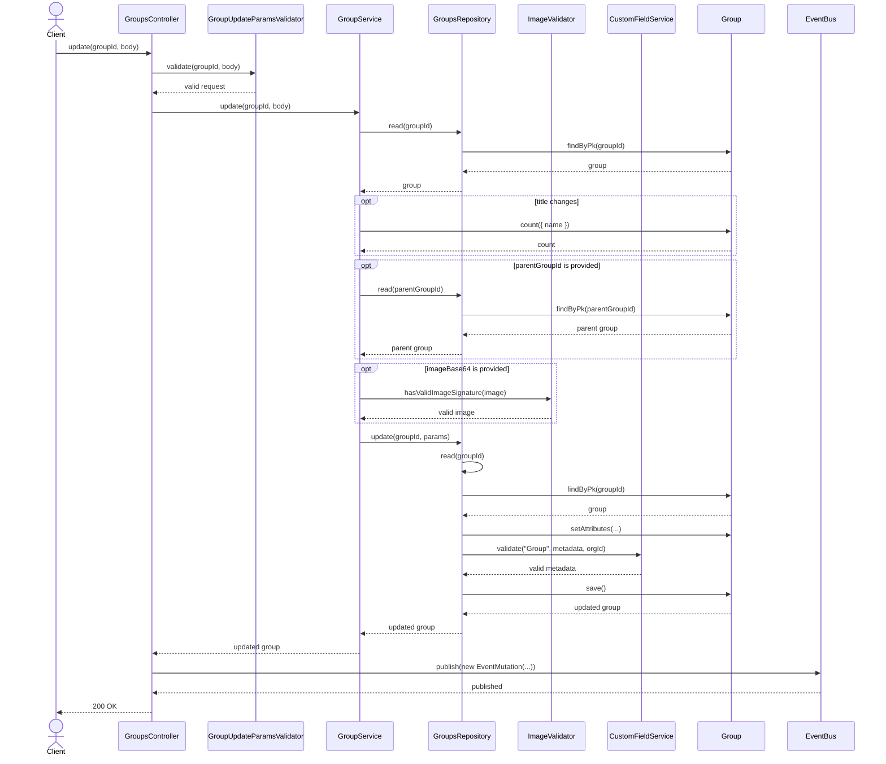
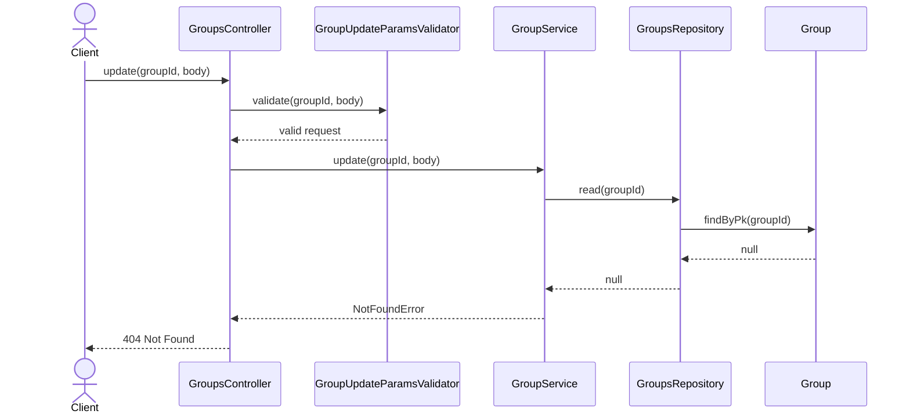
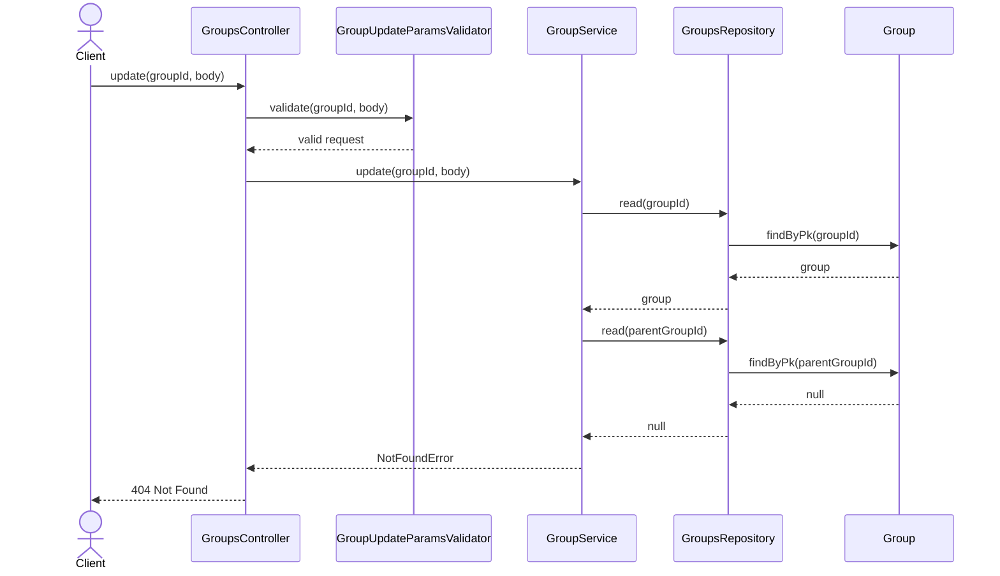
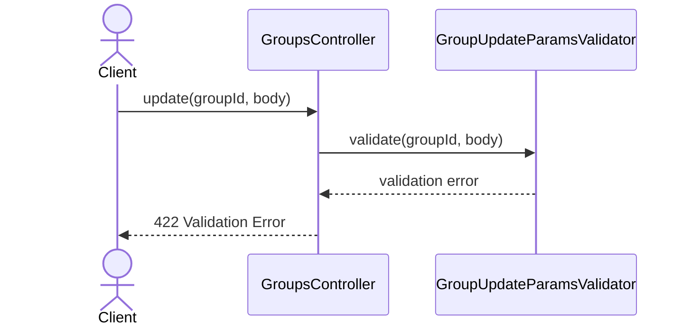
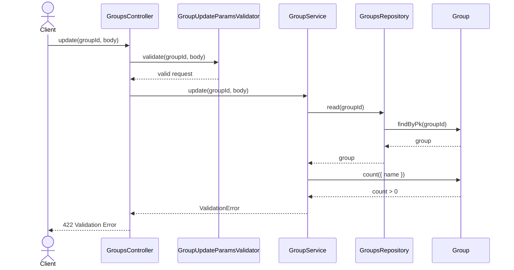
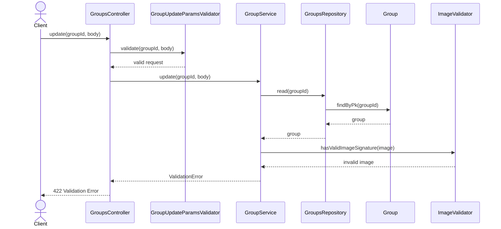
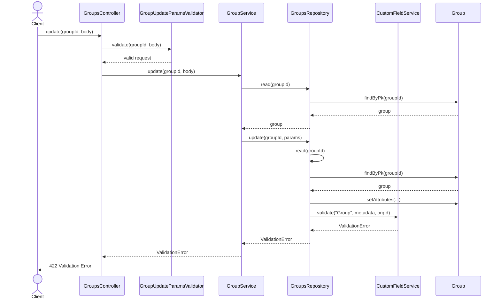

# GroupsController.update

Brief overview: `PUT /v1/groups/:groupId` validates path and body with `GroupUpdateParamsValidator`, then `GroupService.update(groupId, body)` checks group existence, optionally re-slugs and checks duplicate name when `title` changes, optionally resolves `parentGroupId`, optionally validates image signature, omits undefined fields, and calls `GroupsRepository.update(groupId, params)`. The repository reads the group again, applies `setAttributes(...)`, validates custom fields, saves the model, and returns the updated record. The controller publishes an event and returns `200 OK`.

## Method

Route: `PUT /v1/groups/:groupId`  
Controller method: `GroupsController.update(groupId, body)`

## Success

## 404 Not Found

## 404 Parent Group Not Found

## 422 Validation Error

## 422 Duplicate Name Validation Failure

## 422 Invalid Image Validation Failure

## 422 Custom Field Validation Failure

