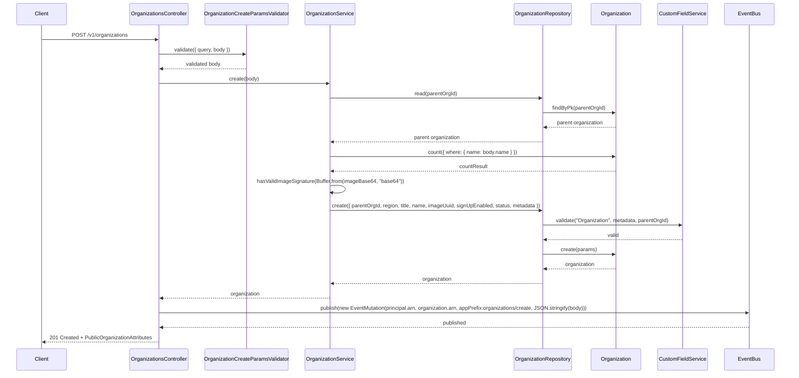
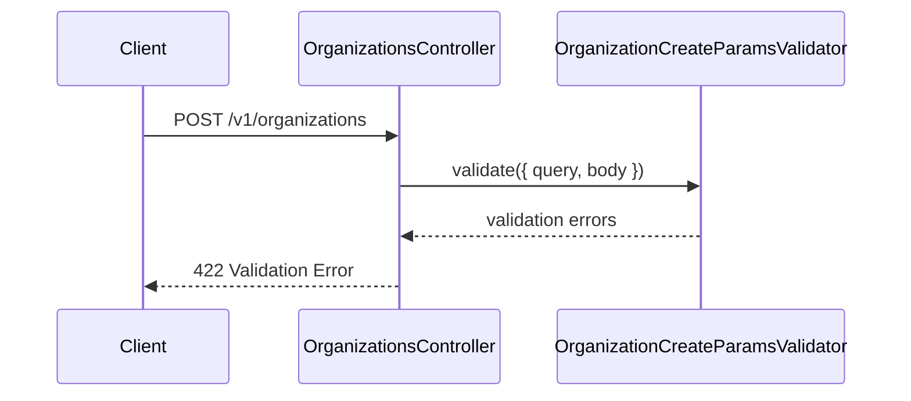
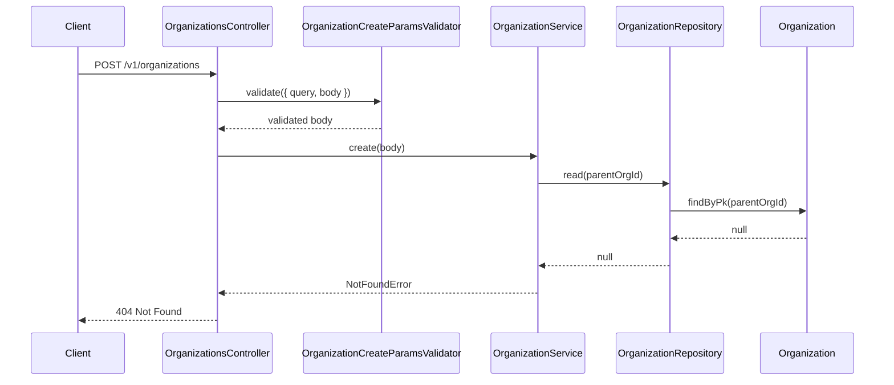
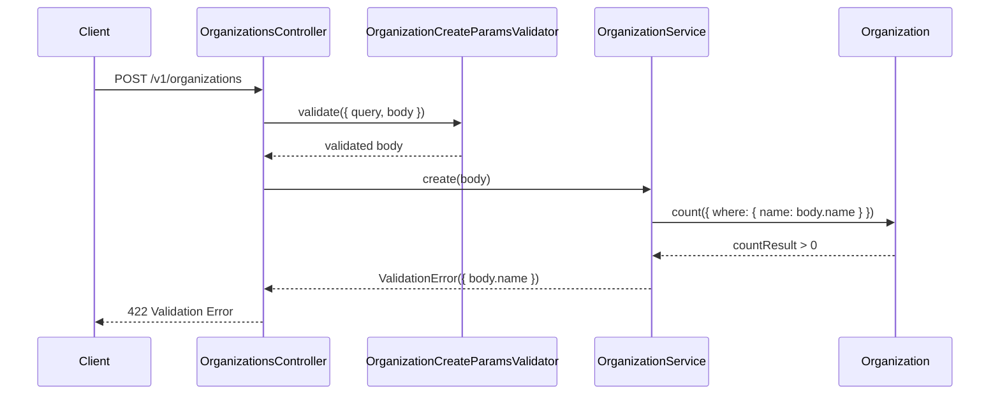
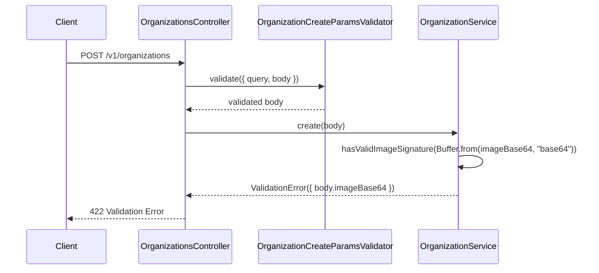
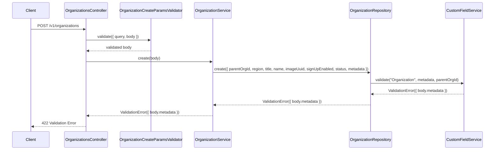

# OrganizationsController.create

Brief overview: Create validates the body, delegates to `OrganizationService.create()`, optionally checks the parent organization, enforces duplicate-name and image rules, validates metadata through `CustomFieldService`, creates the `Organization`, then publishes an event.

## Method

Route: `POST /v1/organizations`  
Controller method: `async create(@Queries() query: {}, @Body() body: OrganizationCreateBodyInterface)`

## Success

## 422 Validation Error

## 404 Not Found

## 422 Duplicate Name Validation Failure

## 422 Invalid Image Validation Failure

## 422 Custom Field Validation Failure

Sources:
- `src/controllers/v1/organizations.controller.ts`
- `src/modules/organizations/organization.service.ts`
- `src/modules/organizations/organization.repository.ts`
- `src/modules/custom-fields/custom-field.service.ts`
- `src/validators/organization-create-params.validator.ts`
- `database/models/organization.ts`
- `test/api/v1/organizations/create.test.ts`

Assumptions:
- The success diagram shows the branch where `parentOrgId` and `imageBase64` are provided, because those are the only code paths with parent lookup and image-signature validation.
