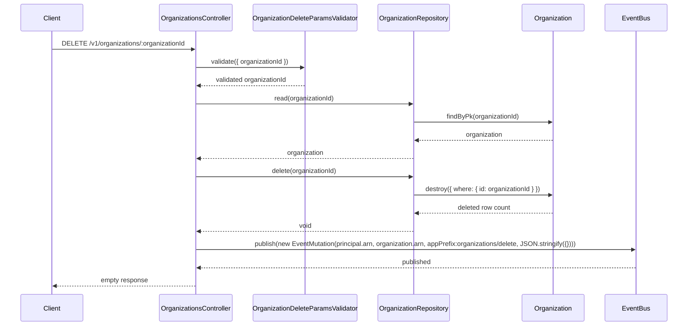
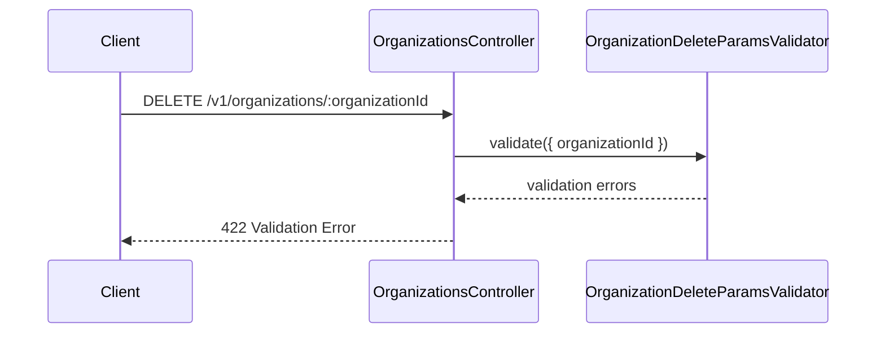
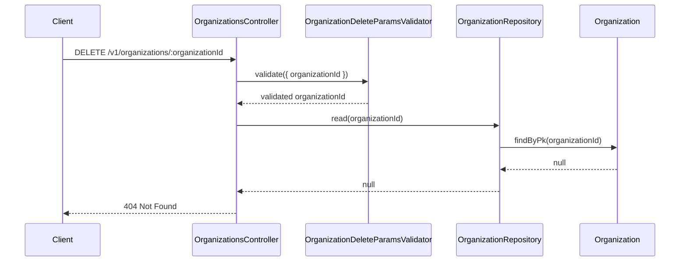

# OrganizationsController.delete

Brief overview: Delete validates the path parameter, reads the organization before deletion to obtain its ARN, deletes it through the repository, publishes a delete mutation event, and returns an empty response.

## Method

Route: `DELETE /v1/organizations/:organizationId`  
Controller method: `async delete(@Path() organizationId: number)`

## Success

## 422 Validation Error

## 404 Not Found

Sources:
- `src/controllers/v1/organizations.controller.ts`
- `src/modules/organizations/organization.repository.ts`
- `src/validators/organization-delete-params.validator.ts`
- `database/models/organization.ts`
- `test/api/v1/organizations/delete.test.ts`

Assumptions:
- The success diagram uses `empty response` instead of an HTTP label because the allowed confirmed labels in the request did not include `204`.
