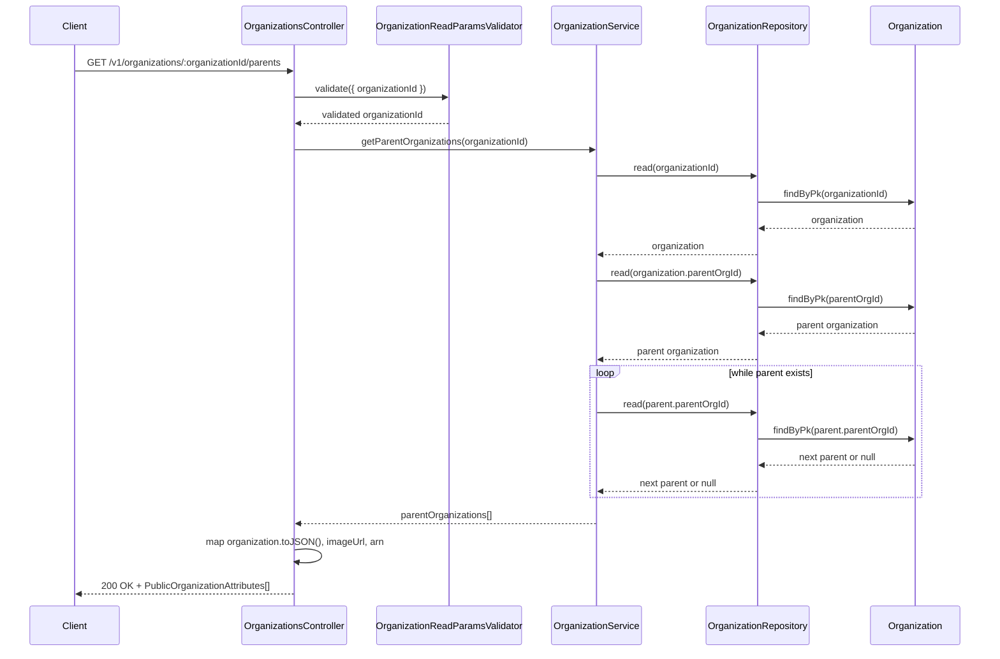
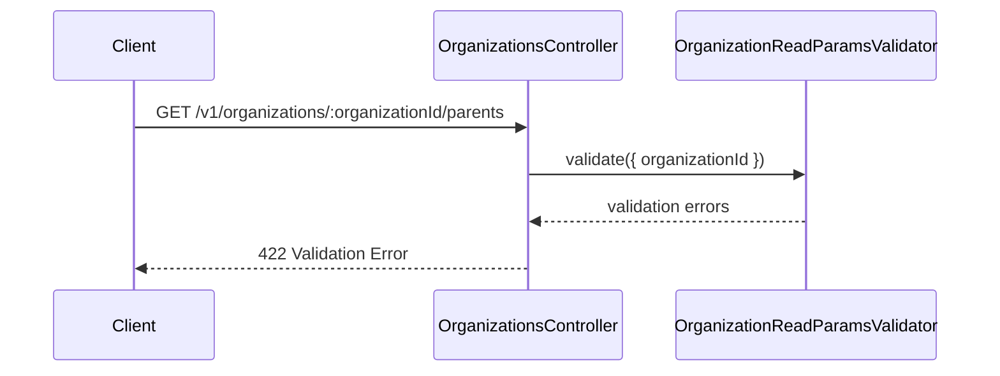

# OrganizationsController.getParents

Brief overview: Get parents validates the path parameter, loads the target organization, then walks the `parentOrgId` chain through `OrganizationService.getParentOrganizations()` until no further parent is found.

## Method

Route: `GET /v1/organizations/:organizationId/parents`  
Controller method: `async getParents(@Path() organizationId: number)`

## Success

## 422 Validation Error

Sources:
- `src/controllers/v1/organizations.controller.ts`
- `src/modules/organizations/organization.service.ts`
- `src/modules/organizations/organization.repository.ts`
- `src/validators/organization-read-params.validator.ts`
- `database/models/organization.ts`
- `test/api/v1/organizations/get-parents.test.ts`

Assumptions: none
