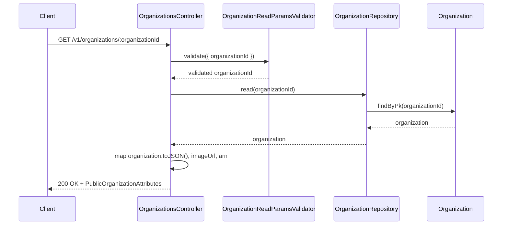
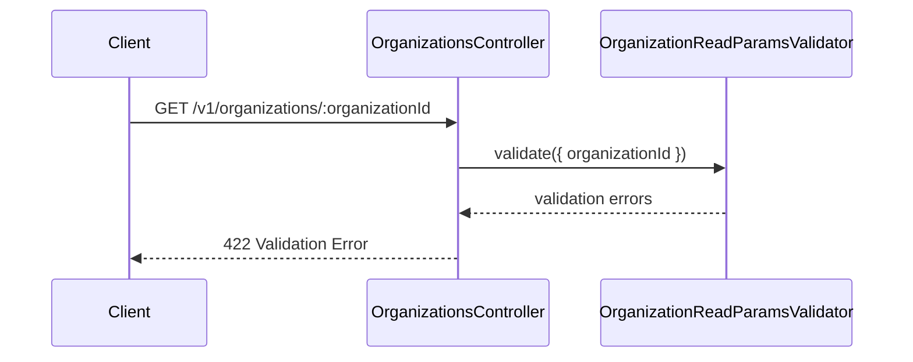
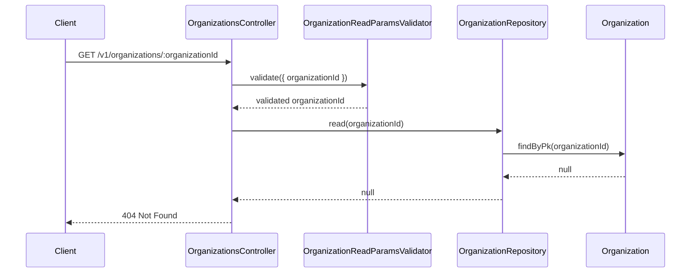

# OrganizationsController.get

Brief overview: Read validates the path parameter, loads one `Organization` by primary key, throws `NotFoundError` when absent, and maps the model to the public response.

## Method

Route: `GET /v1/organizations/:organizationId`  
Controller method: `async get(@Path() organizationId: number)`

## Success

## 422 Validation Error

## 404 Not Found

Sources:
- `src/controllers/v1/organizations.controller.ts`
- `src/modules/organizations/organization.repository.ts`
- `src/validators/organization-read-params.validator.ts`
- `database/models/organization.ts`
- `test/api/v1/organizations/read.test.ts`

Assumptions: none
