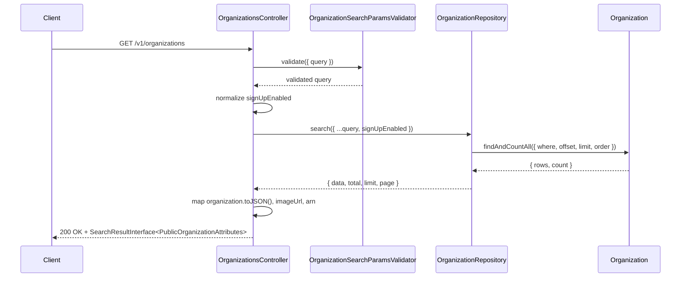
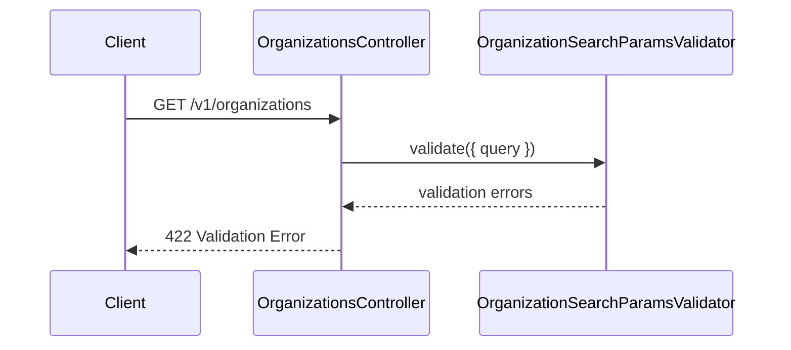

# OrganizationsController.search

Brief overview: GET search validates query params, normalizes `signUpEnabled` inside `OrganizationsController.search()`, then performs a repository search and maps each `Organization` model to the public response shape.

## Method

Route: `GET /v1/organizations`  
Controller method: `async search(@Queries() query: OrganizationSearchParamsInterface)`

## Success

## 422 Validation Error

Sources:
- `src/controllers/v1/organizations.controller.ts`
- `src/modules/organizations/organization.repository.ts`
- `src/validators/organization-search-params.validator.ts`
- `src/validators/common-search-params.validator.ts`
- `database/models/organization.ts`
- `test/api/v1/organizations/search.test.ts`

Assumptions: none
