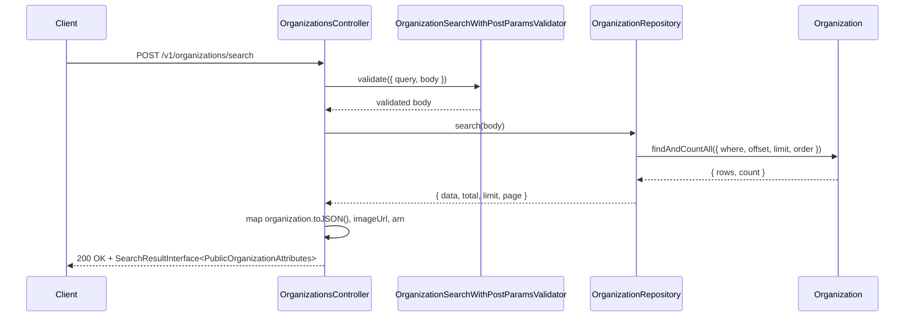
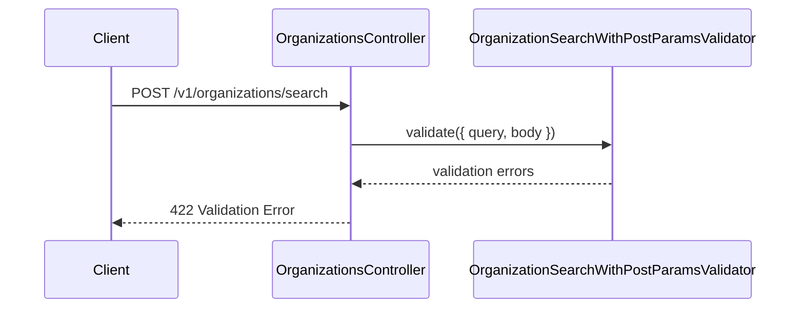

# OrganizationsController.searchPost

Brief overview: POST search validates the request body and forwards it directly to `OrganizationRepository.search()` without the GET-only `signUpEnabled` normalization logic.

## Method

Route: `POST /v1/organizations/search`  
Controller method: `async searchPost(@Queries() query: {}, @Body() body: OrganizationSearchParamsInterface)`

## Success

## 422 Validation Error

Sources:
- `src/controllers/v1/organizations.controller.ts`
- `src/modules/organizations/organization.repository.ts`
- `src/validators/organization-search-with-post-params.validator.ts`
- `src/validators/common-search-params.validator.ts`
- `database/models/organization.ts`
- `src/routes/v1.ts`

Assumptions: none
