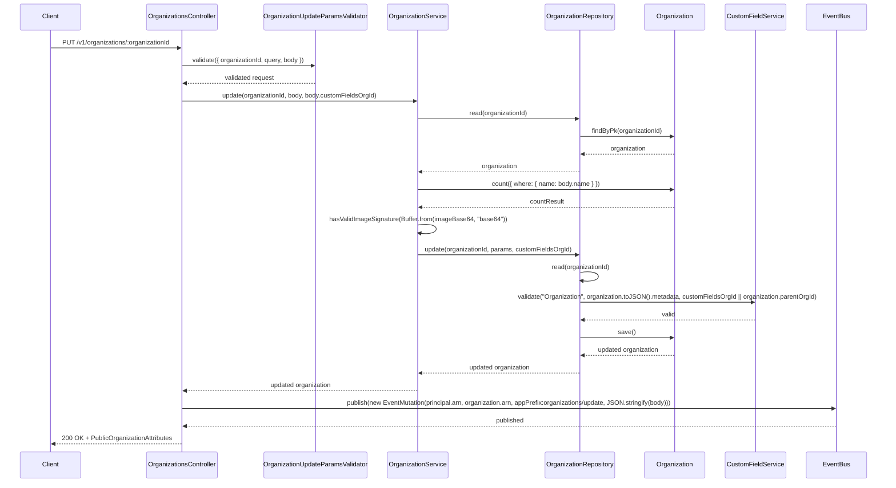
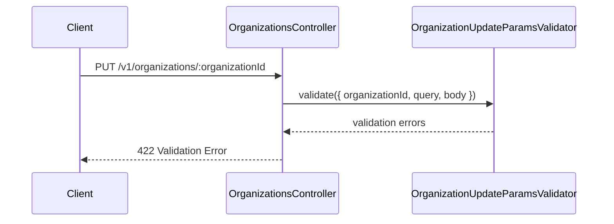
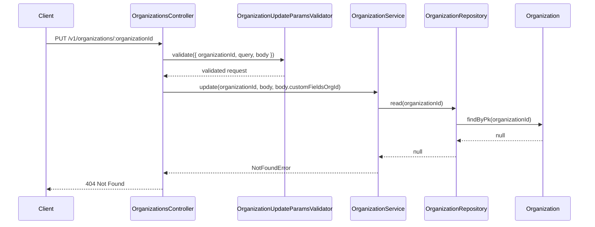
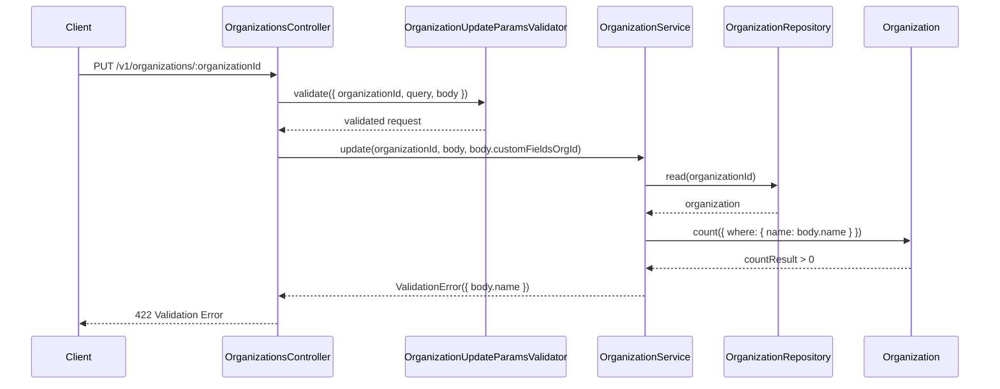
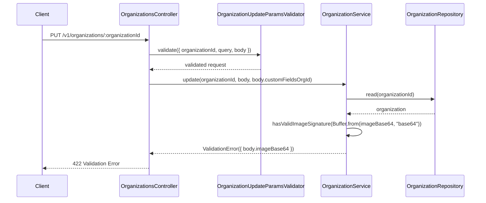
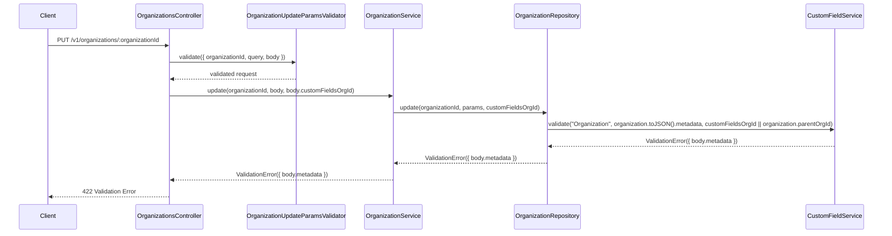

# OrganizationsController.update

Brief overview: Update validates the request, loads the target organization, conditionally checks duplicate name and image payload, validates metadata in the repository using `customFieldsOrgId` when provided, saves the `Organization`, then publishes an event.

## Method

Route: `PUT /v1/organizations/:organizationId`  
Controller method: `async update(@Path() organizationId: number, @Queries() query: {}, @Body() body: OrganizationUpdateBodyInterface)`

## Success

## 422 Validation Error

## 404 Not Found

## 422 Duplicate Name Validation Failure

## 422 Invalid Image Validation Failure

## 422 Custom Field Validation Failure

Sources:
- `src/controllers/v1/organizations.controller.ts`
- `src/modules/organizations/organization.service.ts`
- `src/modules/organizations/organization.repository.ts`
- `src/modules/custom-fields/custom-field.service.ts`
- `src/validators/organization-update-params.validator.ts`
- `database/models/organization.ts`
- `test/api/v1/organizations/update.test.ts`

Assumptions:
- The success diagram shows the branch where `body.name` changes and `imageBase64` is supplied, because those are the only code paths that trigger duplicate-name and image-signature checks.
