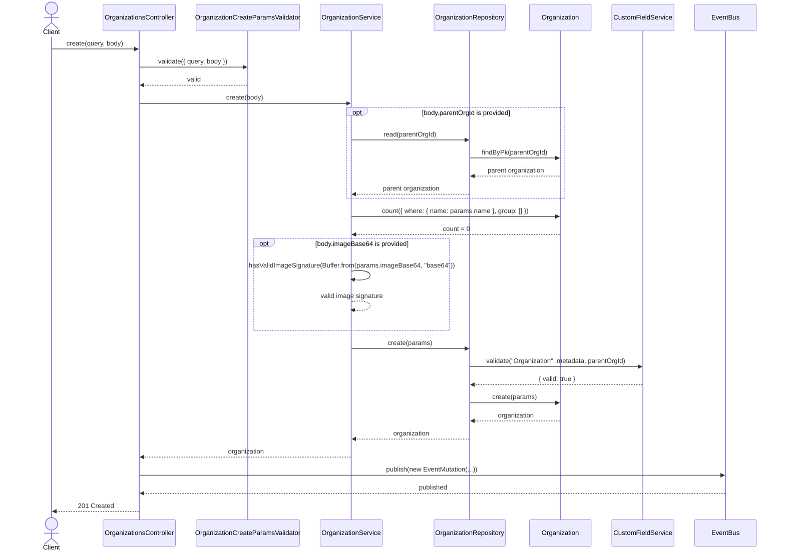
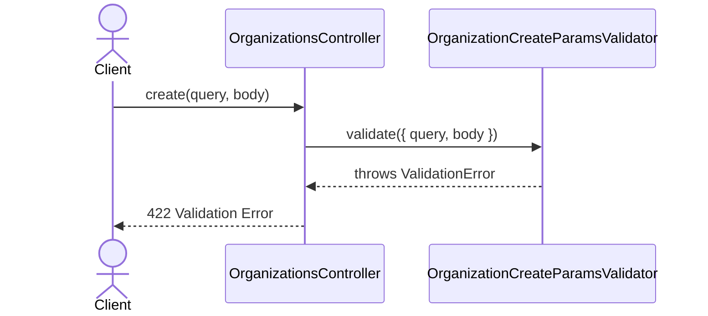
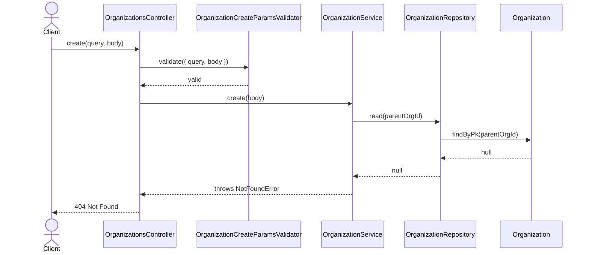
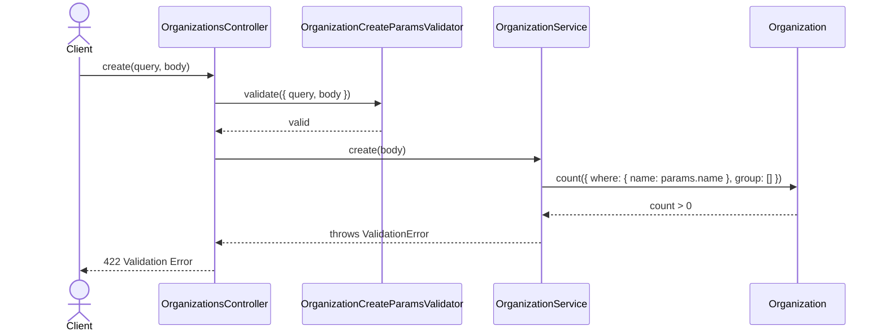
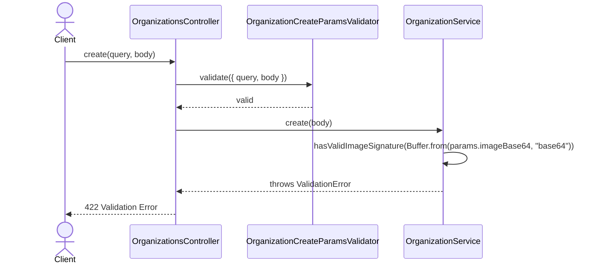
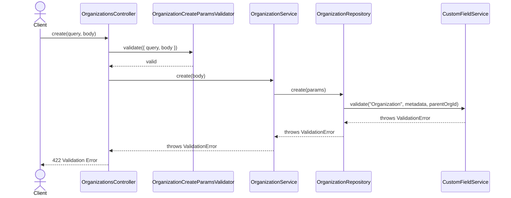

# OrganizationsController.create

Brief overview: Validates the create request, delegates the mutation to `OrganizationService`, optionally checks the parent organization, validates duplicate name, image signature, and custom fields, persists through `OrganizationRepository`, publishes an event, and returns the created organization.

## Method

- Route: `POST /v1/organizations/`
- Signature: `OrganizationsController.create(query: {}, body: OrganizationCreateBodyInterface)`

## Success

## 422 Validation Error

## 404 Not Found

## 422 Duplicate Name Validation Error

## 422 Invalid Image Validation Error

## 422 Custom Field Validation Error

