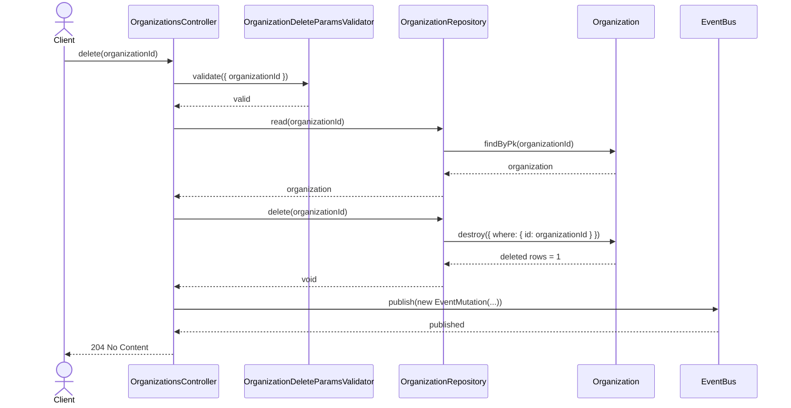
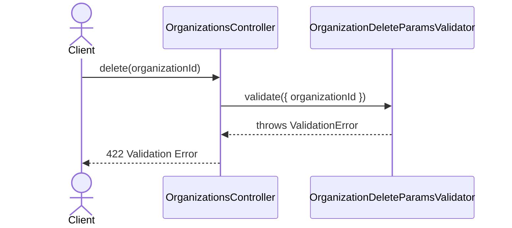
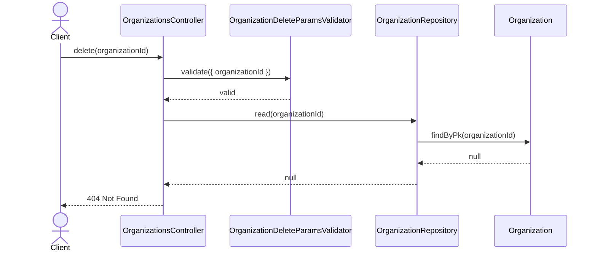

# OrganizationsController.delete

Brief overview: Validates the path parameter, reads the organization before deletion, deletes it through `OrganizationRepository`, publishes a mutation event, and returns no content.

## Method

- Route: `DELETE /v1/organizations/:organizationId`
- Signature: `OrganizationsController.delete(organizationId: number)`

## Success

## 422 Validation Error

## 404 Not Found

