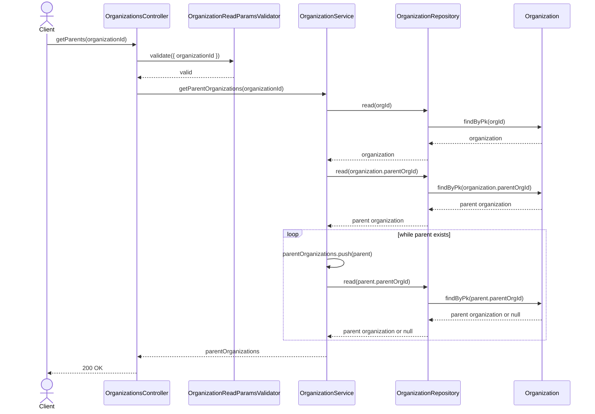
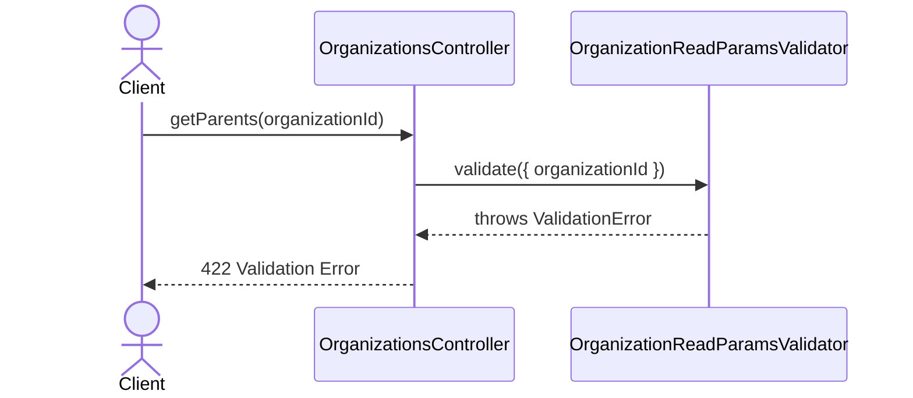

# OrganizationsController.getParents

Brief overview: Validates the organization id, asks `OrganizationService` for the parent chain confirmed by `getParentOrganizations`, and returns the collected parent organizations.

## Method

- Route: `GET /v1/organizations/:organizationId/parents`
- Signature: `OrganizationsController.getParents(organizationId: number)`

## Success

## 422 Validation Error

