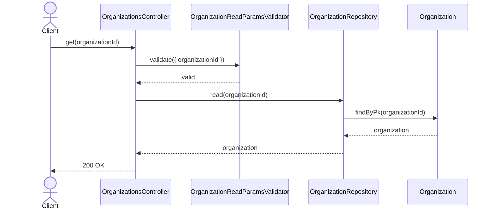
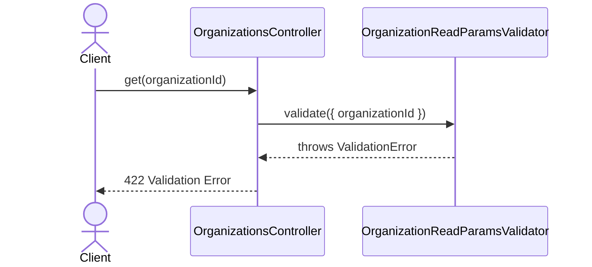
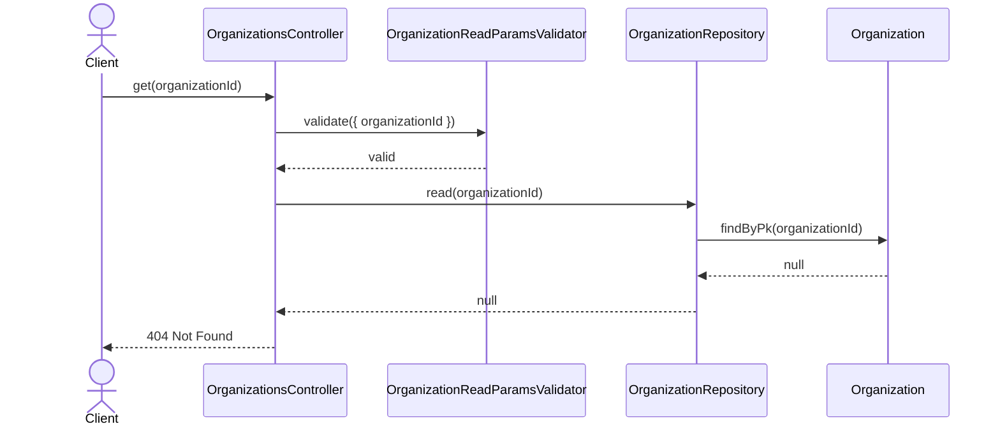

# OrganizationsController.get

Brief overview: Validates the path parameter, reads one organization from `OrganizationRepository`, and returns the public organization payload when the record exists.

## Method

- Route: `GET /v1/organizations/:organizationId`
- Signature: `OrganizationsController.get(organizationId: number)`

## Success

## 422 Validation Error

## 404 Not Found

