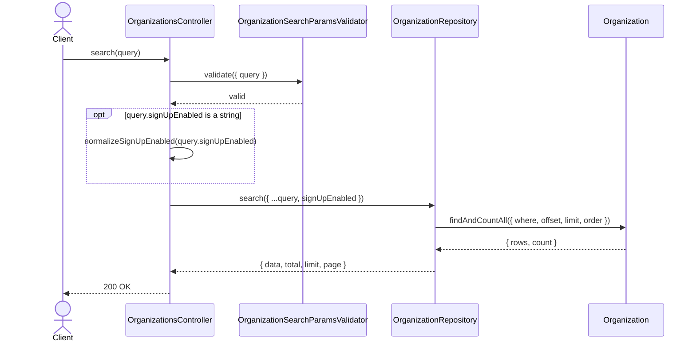
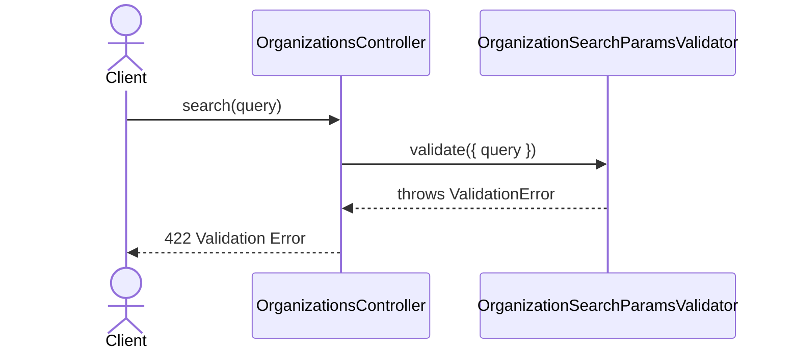

# OrganizationsController.search

Brief overview: Validates the GET search query, normalizes `signUpEnabled` only in the controller when it arrives as a string, queries `OrganizationRepository`, and returns a paginated list of public organizations.

## Method

- Route: `GET /v1/organizations/`
- Signature: `OrganizationsController.search(query: OrganizationSearchParamsInterface)`

## Success

## 422 Validation Error

