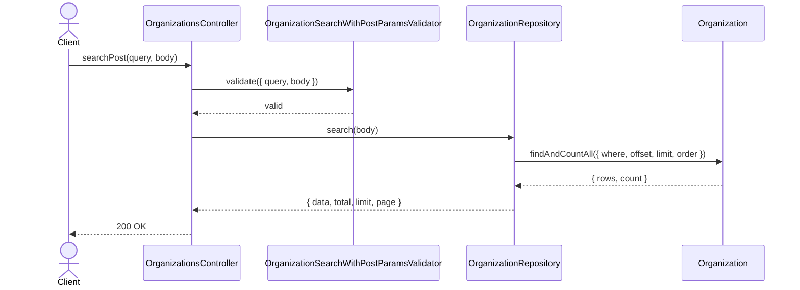
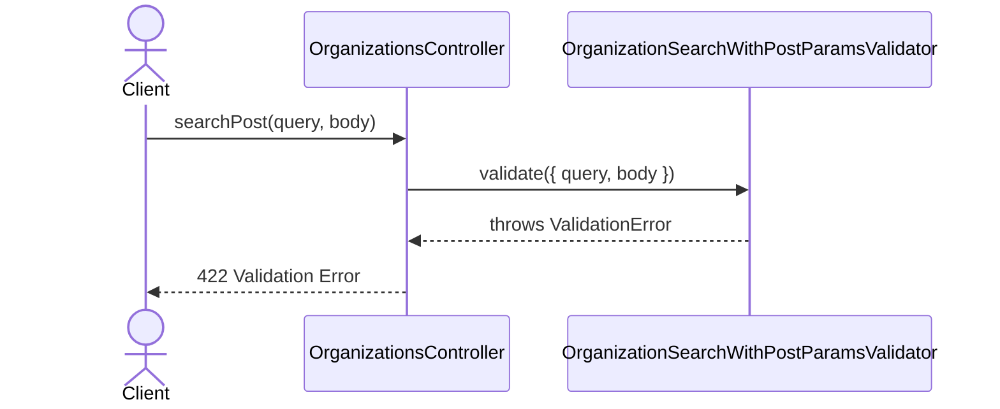

# OrganizationsController.searchPost

Brief overview: Validates the POST search body, passes the body directly to `OrganizationRepository.search(body)`, and returns a paginated list of public organizations without GET normalization logic.

## Method

- Route: `POST /v1/organizations/search`
- Signature: `OrganizationsController.searchPost(query: {}, body: OrganizationSearchParamsInterface)`

## Success

## 422 Validation Error

