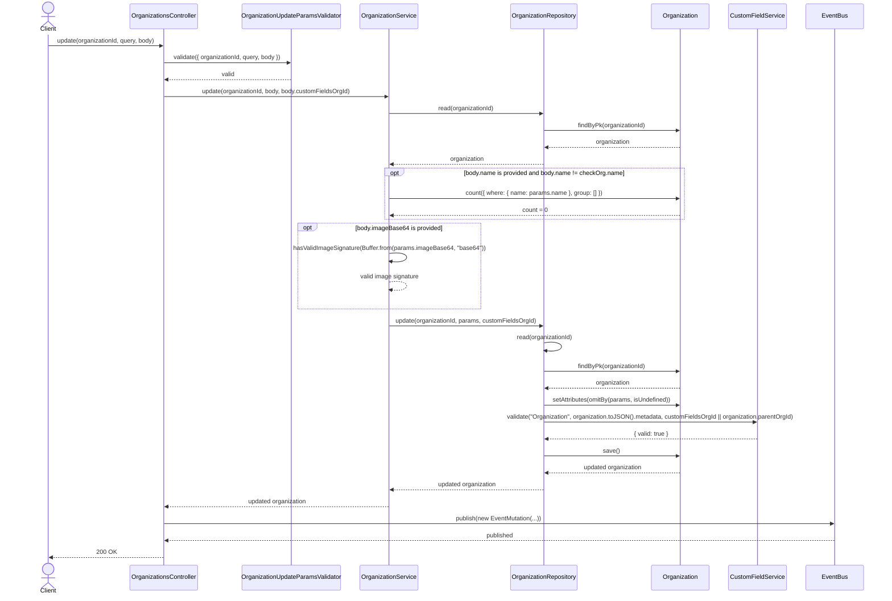
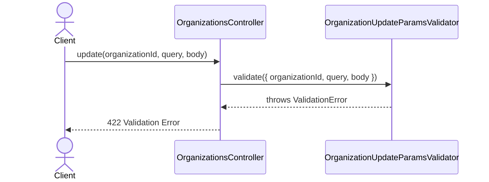
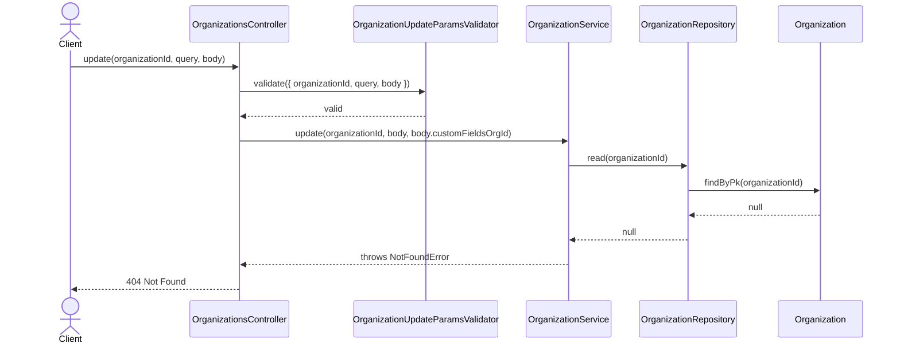
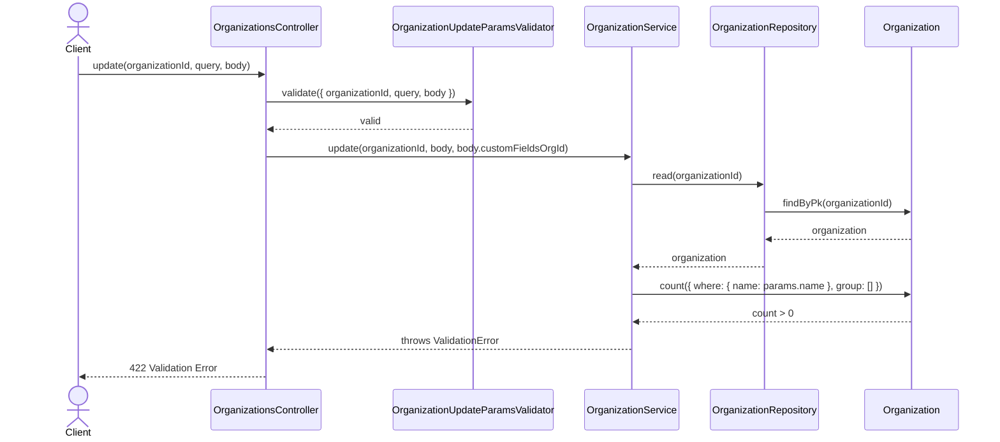
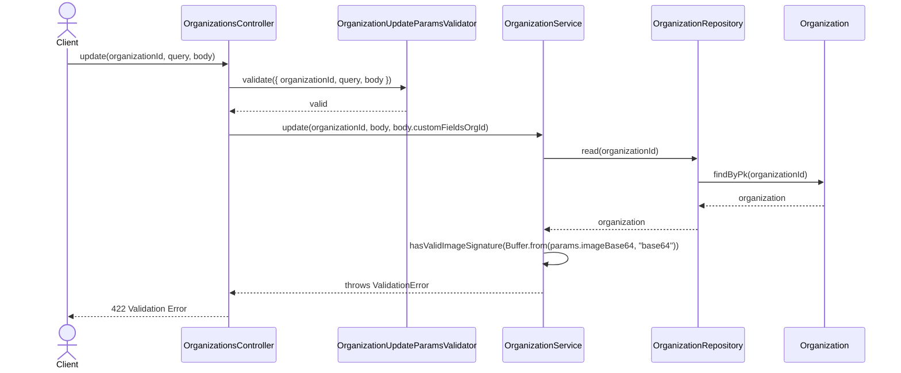
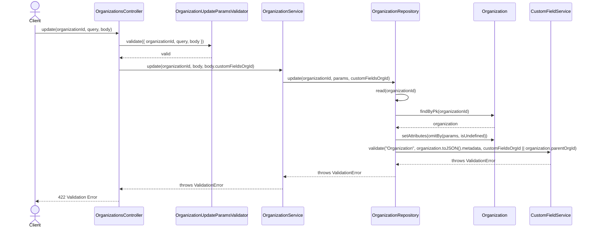

# OrganizationsController.update

Brief overview: Validates the update request, delegates the mutation to `OrganizationService`, loads the target organization, optionally checks duplicate name and image signature, updates through `OrganizationRepository` with `customFieldsOrgId`, validates custom fields, saves, publishes an event, and returns the updated organization.

## Method

- Route: `PUT /v1/organizations/:organizationId`
- Signature: `OrganizationsController.update(organizationId: number, query: {}, body: OrganizationUpdateBodyInterface)`

## Success

## 422 Validation Error

## 404 Not Found

## 422 Duplicate Name Validation Error

## 422 Invalid Image Validation Error

## 422 Custom Field Validation Error

