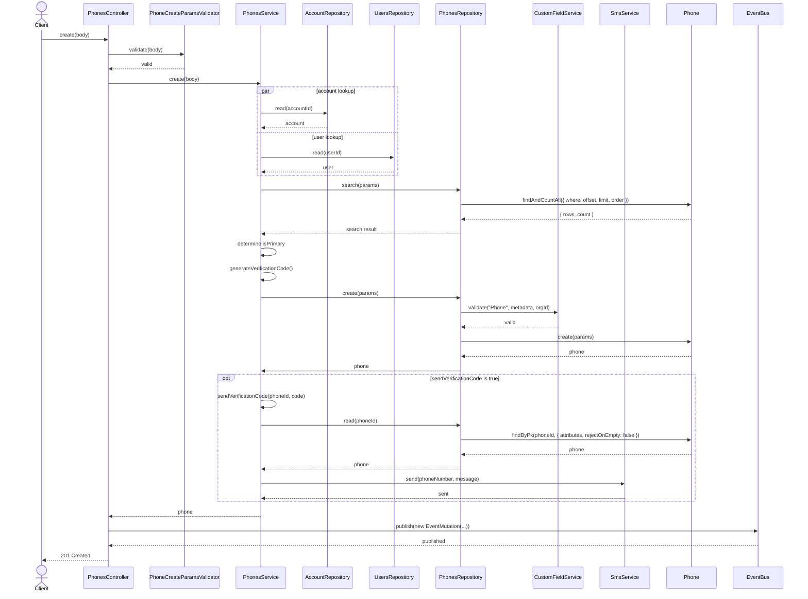
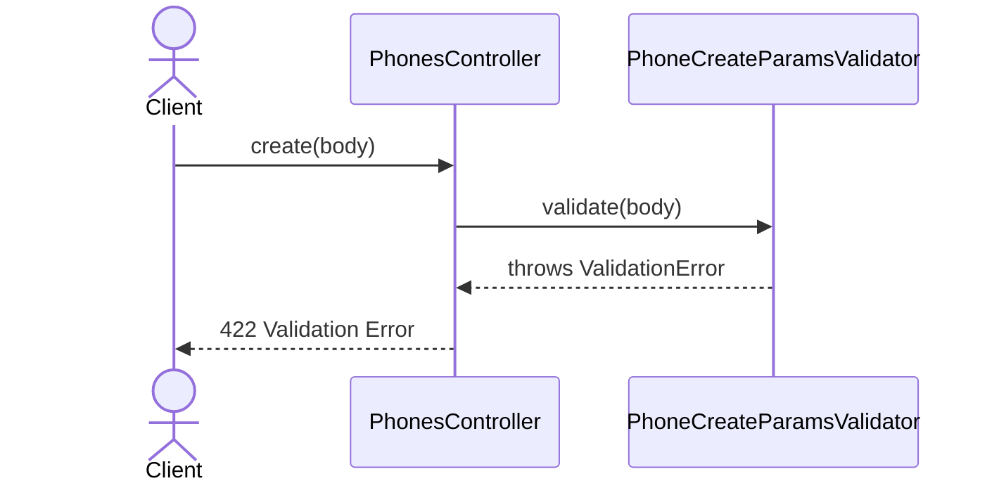
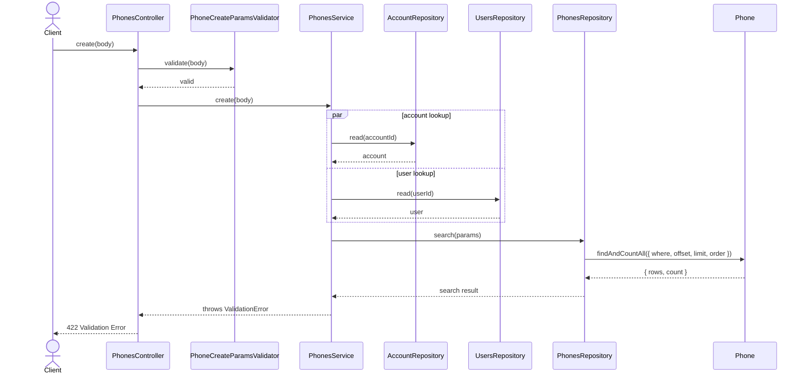
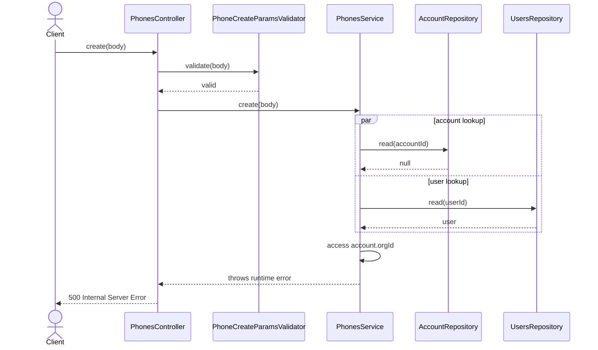
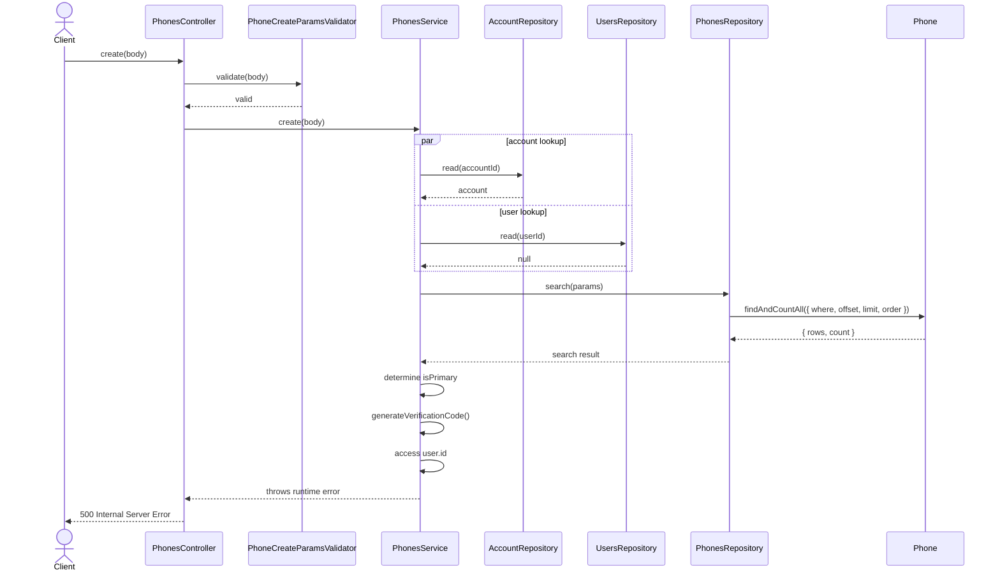
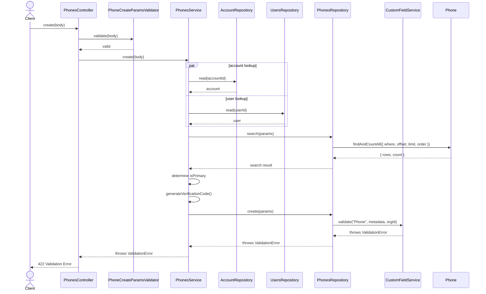

# PhonesController.create

Brief overview: Validates the create request, delegates to `PhonesService` for account and user lookup, checks for duplicate phones and primary-phone state, creates the phone through `PhonesRepository` with custom field validation, optionally sends a verification code through `SmsService`, publishes an event, and returns `201 Created`.

## Method

- Route: `POST /v1/phones`
- Signature: `PhonesController.create(query: {}, body: PhoneCreateBodyInterface)`

## Success

## 422 Validation Error

## 422 Duplicate Phone Validation Failure

## 500 Internal Server Error Missing Account Runtime Failure

## 500 Internal Server Error Missing User Runtime Failure

## 422 Custom Field Validation Failure

