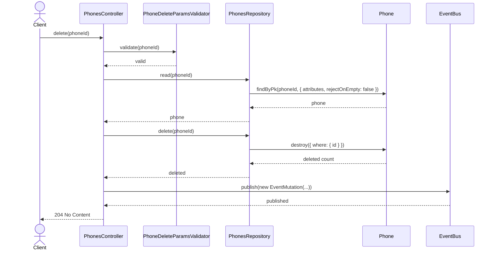
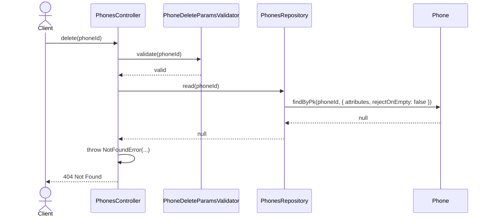
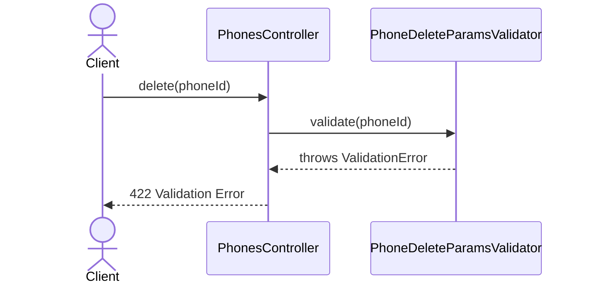

# PhonesController.delete

Brief overview: Validates the path parameter, reads the phone before deletion through `PhonesRepository`, deletes it, publishes an event, and finishes with `204 No Content`.

## Method

- Route: `DELETE /v1/phones/:phoneId`
- Signature: `PhonesController.delete(phoneId: number)`

## Success

## 404 Not Found

## 422 Validation Error

