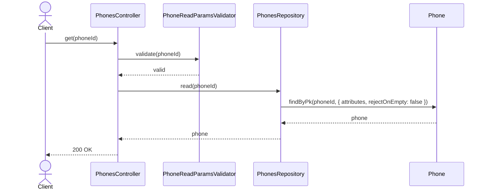
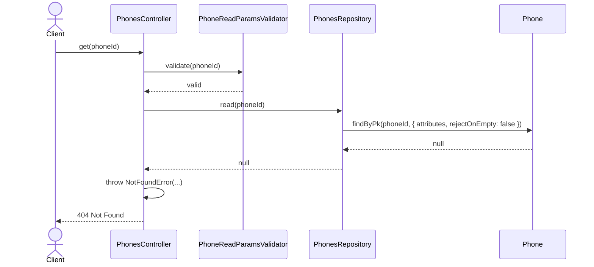
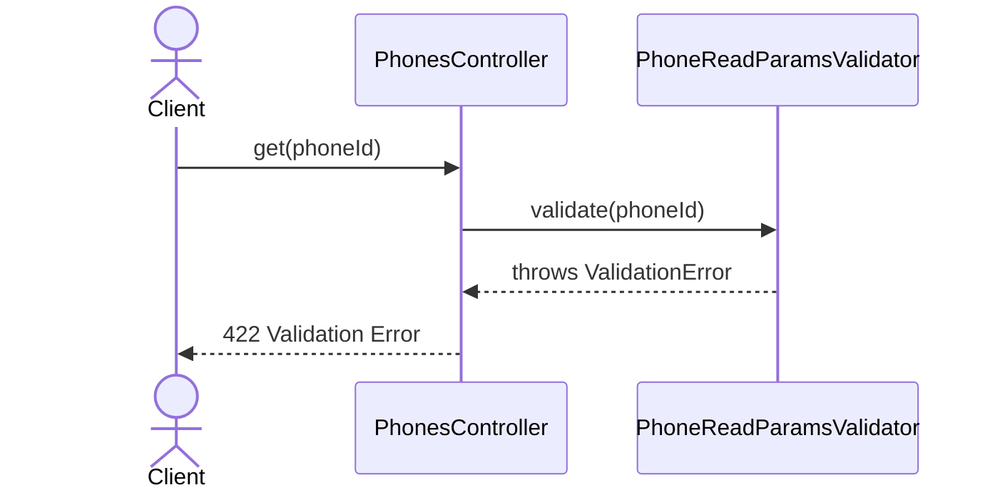

# PhonesController.get

Brief overview: Validates the path parameter, reads one phone from `PhonesRepository`, returns `200 OK` when found, and throws `NotFoundError` with `404 Not Found` when the phone does not exist.

## Method

- Route: `GET /v1/phones/:phoneId`
- Signature: `PhonesController.get(phoneId: number)`

## Success

## 404 Not Found

## 422 Validation Error

