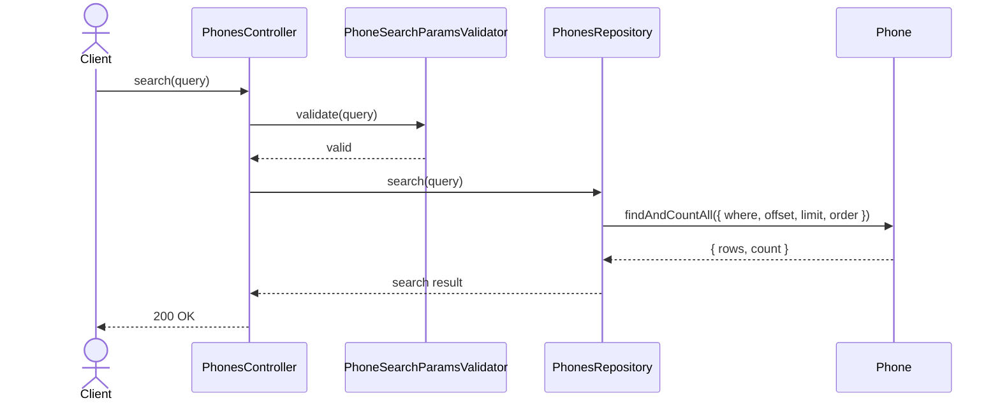
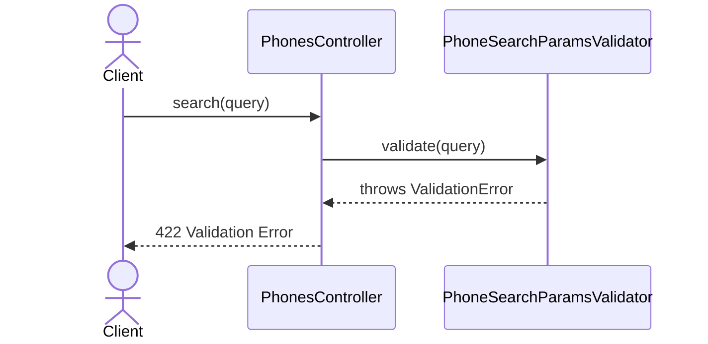

# PhonesController.search

Brief overview: Validates the GET search query, queries `PhonesRepository` directly, and returns `200 OK` when the paginated phone search completes successfully.

## Method

- Route: `GET /v1/phones`
- Signature: `PhonesController.search(query: PhoneSearchParamsInterface)`

## Success

## 422 Validation Error

